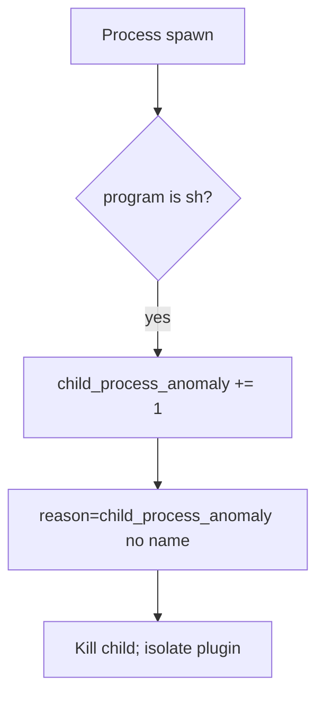

# 6.1-LO-06 — Detect child_process_anomaly

**Kind:** operations-exercise
**Loop step:** 6 Operate
**Standards:** NIST CSF 2.0 (final) DE/RS/RC as outcome labels; OWASP ASVS 5.0.0 (final) `v5.0.0-1.2.5`.

## Prevention is not absolute

A plugin path can bring `sh -c` back. Pair detect and recover. Do not log export names that are patient identifiers.

## Mental model: unexpected child is a signal



| Outcome | This module |
|---|---|
| Detect | `child_process_anomaly` |
| Signal | request id, program basename; never the full argv if it holds PHI |
| Recover | Kill; remove the concatenating path; isolate a needed-shell plugin |
| Residual | Argument injection; host compromise if it left the lab (must not) |

## Practice

Write one log line you would accept. Tie it to `labs/6.1/6.1-lab`.

```
log_denied reason=child_process_anomaly program=sh request_id=req_61a
```

Reject any line that includes a note body, a real email, or a shell cookbook.

## Transfer

Clinic: detect unexpected `sh` under the export worker; do not paste filenames into the ticket if they are patient ids.

## Non-goals

EDR product names are not the property.
