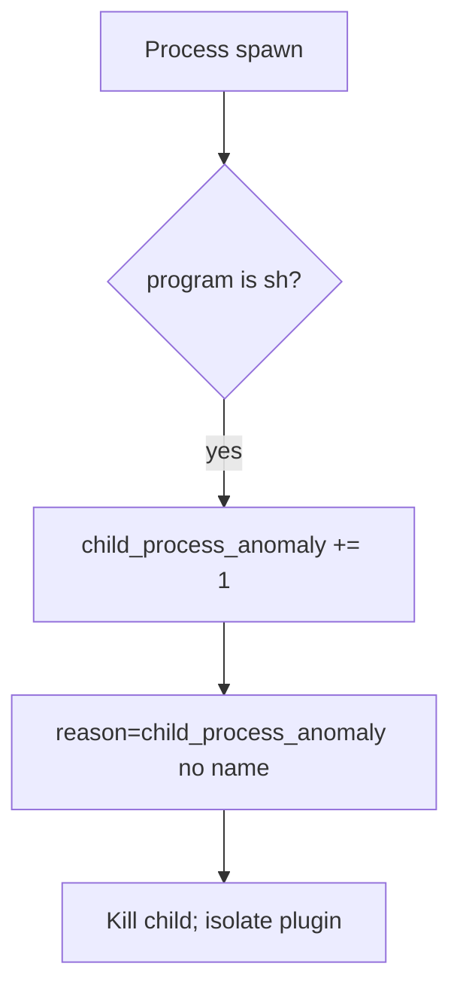

# Notice a child-process anomaly

**Kind:** operations-exercise
**Loop step:** 6 Operate

## Fixing it once is not enough

Even after `argv_for_list` was “fixed once,” a plugin path can bring `sh -c` back. Running it for real is the rest of the loop: notice, contain, and recover.

Do not log export names that are patient identifiers. Do not paste filenames into the ticket if they are patient data.

## Picture: unexpected child is a signal

A child whose program is `sh` after an export-helper change is a notice-and-recover problem, not a licence to quote filenames in the paging channel. Recover kills the child and removes the concatenating path. Neither reprints the name.



A vendor name does not build argv. Someone still has to own the concatenating path.

## Signals that do not become a second leak

| Outcome | This topic |
|---|---|
| Notice | `child_process_anomaly` |
| What the line holds | request id, program basename — **never** the full argv if it holds patient data |
| Respond | Kill the child; isolate a needed-shell plugin |
| Recover | Remove the concatenating path; re-run `test_does_not_invoke_shell` |
| Leftover | Argument injection; host compromise if it left the lab (must not) |

```text
log_denied reason=child_process_anomaly program=sh request_id=req_61a
```

Not: a note body, a real email, a patient filename, or a shell-punctuation cookbook.

If your alert includes the full argv with a patient filename, you have opened a second leak in the paging channel (3.1 / 5.1).

A green “no shell in CI grep” tile is not that check. Plugin loaders are other paths of the same check — inventory them before claiming recover.

## What the framework does vs what you still have to check

A host product will page on `sh` children and stay silent when the Python helper still returns `["sh", "-c", …]` in a test that nobody runs. Detection must observe **program basename `sh` at spawn**, not a scanner nickname. If the alert includes the full argv with a patient filename, you have opened a leftover hole from topics 3.1 and 5.1.

## Practice

Write a log line (ids, reason, program basename, no name). Reject any line that includes a note body, a real email, a patient filename, or a shell cookbook.

## Use it somewhere new

A clinic example: notice unexpected `sh` under the export worker; do not paste filenames into the ticket if they are patient ids. Do not hunt a live worker.

## What this page is not doing

Do not use live command execution is out of scope. This site does not mark you as finished. Answer keys are not on this site.
