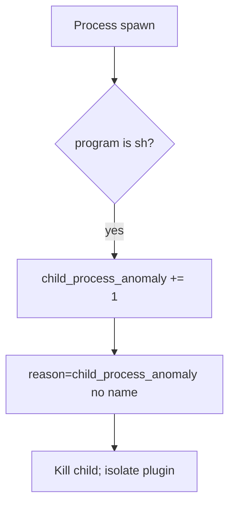

# 6.1-LO-06 — Detect child_process_anomaly

**Kind:** operations-exercise
**Loop step:** 6 Operate
**Standards:** NIST CSF 2.0 (final) DE/RS/RC as outcome labels; OWASP ASVS 5.0.0 (final) `v5.0.0-1.2.5`. CSF names outcomes; it does not build argv.

## Prevention is not absolute

A plugin path can bring `sh -c` back after `argv_for_list` was “fixed once.” Pair detect and recover. Do not log export names that are patient identifiers. Do not paste filenames into the ticket if they are PHI.

## Mental model: unexpected child is a signal



| Outcome | This module |
|---|---|
| Detect | `child_process_anomaly` |
| Signal | request id, program basename; never the full argv if it holds PHI |
| Recover | Kill; remove the concatenating path; isolate a needed-shell plugin |
| Residual | Argument injection; host compromise if it left the lab (must not) |

CSF 2.0 Detect / Respond / Recover name outcomes. They do not prove `v5.0.0-1.2.5`. An EDR product name is not the property. Re-run `test_does_not_invoke_shell` after any export-worker change; a green “no shell in CI grep” tile is not that pytest. Plugin loaders are other paths of the same cell — inventory them before claiming Recover.

## Framework defaults versus the operate guarantee

A host EDR will page on `sh` children and stay silent when the Python helper still returns `["sh", "-c", …]` in a test that nobody runs. Detection must observe **program basename `sh` at spawn**, not a scanner CWE. If the alert includes the full argv with a patient filename, you have opened a 3.1 / 5.1 cell.

## Practice

Write one log line you would accept. Tie it to `labs/6.1/6.1-lab`.

```text
log_denied reason=child_process_anomaly program=sh request_id=req_61a
```

Reject any line that includes a note body, a real email, a patient filename, or a shell cookbook.

## Transfer

Clinic: detect unexpected `sh` under the export worker; do not paste filenames into the ticket if they are patient ids. Do not run a live worker hunt.

## Non-goals

EDR product names are not the property. Live command execution is out of scope. Gates 0–10 stay not-attempted.
