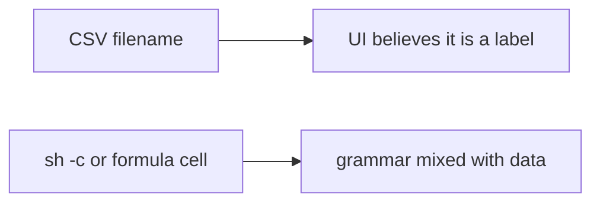

# Same idea on a clinic CSV filename

**Kind:** transfer-challenge
**Loop step:** 7 Transfer

## Use it somewhere new

You get a **clinic export-to-CSV filename** chosen by a clerk.

On the notes app, `argv_for_list` must not start `sh -c`. Pass the name as one argv element. For a clinic, the spawn helper returns a list whose program is not `sh`, and the filename is one element.

Also name Jinja, SQL (5.5), and mail headers as the same shape, without running those systems.

## Picture: the filename is still an interpreter input

Calling it “CSV filename” instead of “export name” does not move the work.

| Notes app this week | Clinic sketch |
|---|---|
| `name` glued into `sh -c` | Clerk-chosen filename glued into `sh -c` |
| `argv_for_list` | Export-worker spawn helper |
| Argv list `ls -- name` | Argv list with the filename as one element |
| Member choosing an export name | Clerk choosing a download name — **not** a live clinic |

If the clerk-chosen filename is concatenated into `sh -c`, the check is gone. FastAPI, a denylist of punctuation, and “internal clerk” trust do not bind argv. Jinja, SQL (5.5), and mail headers are the same shape at other parsers — name them, do not run those systems here. Formula characters in the CSV *body* are advanced leftover, a different residual.

The spawn helper returns a list whose program is not `sh`, and the name is one element. Stripping punctuation while still calling `sh -c` leaves the second parser. The local check is `test_does_not_invoke_shell` — on a practice, not a live export worker.

## Write this for a clinic CSV filename

1. who can act (clerk-chosen filename — not a live clinic);
2. what you trust (argv list is what you trust; a denylist of punctuation is not);
3. what must not happen (`argv_for_list` starts `sh -c`);
4. a test idea on **local** practice files only (shape, no execution — never on the real clinic);
5. leftover (argument injection; CSV formula leftover; plugin shells);
6. whether a human-read “export failed” status must not use color as the only cue (readable error, not a silent missing file).

## What is not good enough

| Reject | Why |
|---|---|
| “We blacklist punctuation” | Incomplete mediation (2.1) |
| Live clinic probe | Course rules |
| Scanner name as the rule | Awareness after the cause |
| HTTP 200 as argv evidence | Wrong observation |
| Executing argv to prove the finding | Course rules |

## Practice

One page. No answer keys. The only running system you may break is `labs/6.1/6.1-lab`. Do not execute argv or run a live worker.

## What this page is not doing

Do not try live-target shells. Do not use real patient filenames. This page does not finish a check-in.
