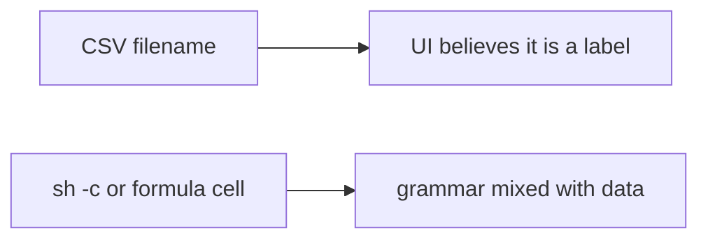

# 6.1-LO-07 — Transfer: clinic export-to-CSV filename

**Kind:** transfer-challenge
**Loop step:** 7 Transfer
**Standards:** OWASP ASVS 5.0.0 (final) `v5.0.0-1.2.5`; `v5.0.0-1.2.10` Level 3 advanced for formula characters.

## Change the workplace; keep data-vs-grammar

Do not answer with a Top 10 / CWE / scanner as the definition of security.

**Prompt:** Clinic export-to-CSV filename chosen by a clerk. Also name Jinja, SQL (5.5), and mail headers as the same shape.

**Product sketch:** EHR-lite “download roster” that shells out to `ls` or to a CSV writer.

Rewrite the SecureCollab sentence. Include:

1. attacker capabilities (clerk-chosen filename — not a live clinic);
2. trust assumptions (argv list is TCB; denylist of `;` is not);
3. forbidden outcome (`argv_for_list` starts `sh -c`, not “HIPAA”);
4. a test idea on a **local** fixture only (shape, no execution);
5. residual (argument injection; CSV formula Level 3; plugin shells);
6. WCAG if a human “export failed” path is in the claim (readable error, not a silent missing file).

## Mental model: filename is still an interpreter input

## What graders reject

| Reject | Why |
|---|---|
| “We blacklist semicolons” | Incomplete mediation (2.1) |
| Live clinic probe | Lab policy |
| CWE-78 as the property | Awareness after the cause |

## Practice

One page. No keys. `labs/6.1/6.1-lab` is the only running system you may break.
