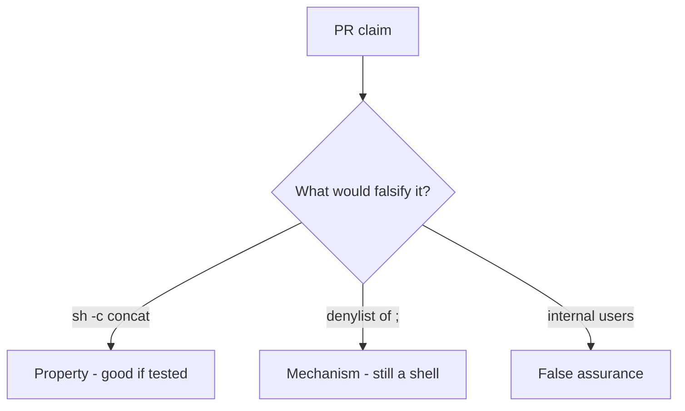

# 6.1-LO-08 — Review sh -c concatenation as a PR, not a CWE ticket

**Kind:** code-review
**Loop step:** Review
**Standards:** OWASP ASVS 5.0.0 (final) `v5.0.0-1.2.5`.

## Review the fixture as if it were SecureCollab export listing

Review `labs/6.1/6.1-lab/vulnerable/` as a SecureCollab PR. Your job is not to count suspicious lines. Reconstruct whether `argv_for_list("notes")` still starts `["sh", "-c"]`, compare that with the module invariant, and write changes a developer can verify.

Intended findings live only in `content/assessment/keys/6.1.md` — not here. Do not open the keys file until your review has been evaluated.

## Mental model: shell=True or sh -c concatenation

Start with this seeded smell: **`shell=True` or `sh -c` concatenation**. Label it property, mechanism, or false assurance before you accept the PR.

Classification starts at the protected effect (program is not `sh`; name is one element). Everything that is not an argv list at that call is a candidate second parser. A denylist of `;` while `uses_shell` stays true is the same smell, not a different finding class.

## Seeded smells (label them yourself)

- `shell=True` or `sh -c` concatenation
- Blacklist of `;` as the fix
- No `uses_shell` test
- Comment “user is trusted internally”

Also reject: live command execution; closing findings without re-running `test_does_not_invoke_shell`; keys in lessons; metacharacter cookbooks in the PR.

## Misconceptions this module refuses

- Injection is one CWE
- ORM/subprocess wrappers auto-escape shells
- Scanner finding is the invariant
- Internal users make a shell safe
- Executing argv is how you test this cell

## Practice

Write three review notes a maintainer could act on. Each note: observation, property or false assurance, suggested structural change, residual you will **not** delete. Tie at least one to `test_does_not_invoke_shell`.

## Transfer

Clinic PR that “sanitized the filename” and still calls `sh -c` is an incomplete mediation review. Name the independent falsehood that would still keep `argv_for_list` from starting `sh -c`.

## Non-goals

Do not merge by adding a comment “will switch to argv later.” That comment is a residual without an owner. Do not execute a live command to prove the finding.
