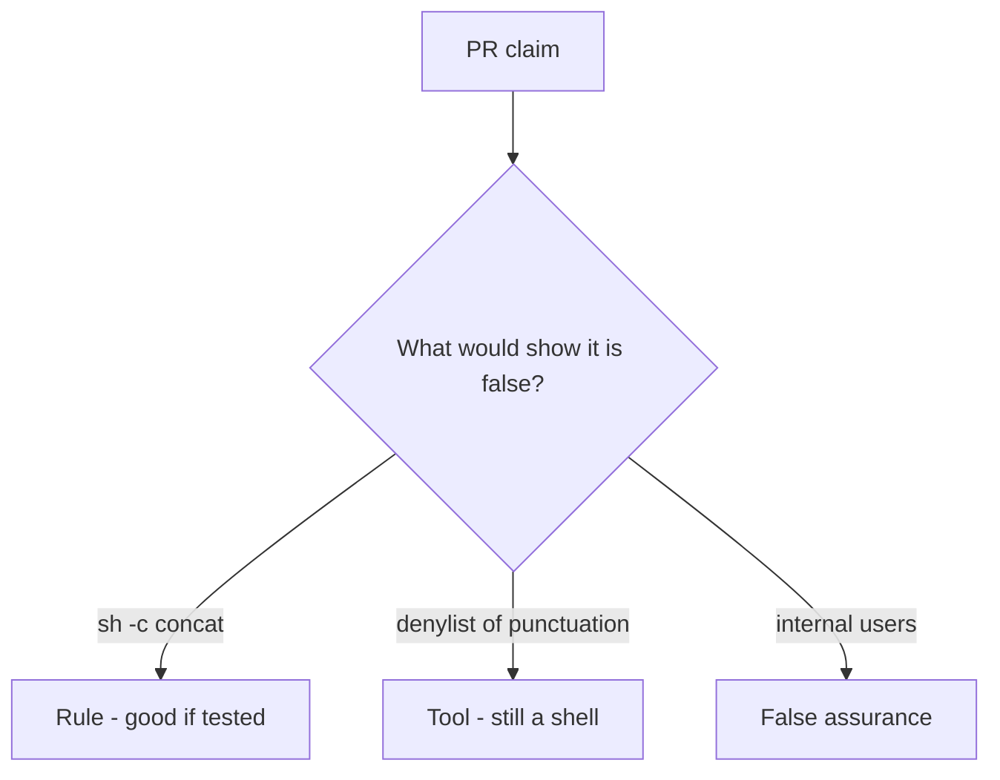

# Review of concatenating into sh -c

**Kind:** code-review
**Loop step:** Review

## What you are reviewing

You are reviewing export listing. Label each claim **rule**, **tool**, or **false assurance**. Say whether `argv_for_list("notes")` still starts `["sh", "-c"]` if they ship. Start at `sh -c` concatenation, not at a scanner color.

A comment “will switch to argv later” is not a pass on `test_does_not_invoke_shell`.

## Picture: problems to find (name them yourself)

**`shell=True` or `sh -c` concatenation**.

The program still cannot be `sh`, and the name still has to be one element. If the change never uses an argv list, that second parser is still open. A denylist of punctuation while `uses_shell` stays true is still the same problem.

## Problems to find (name them yourself)

- `shell=True` or `sh -c` concatenation
- Blacklist of punctuation as the fix
- No `uses_shell` test
- Comment “user is trusted internally”

Also reject: live command execution; closing findings without re-running `test_does_not_invoke_shell`; keys in learner notes; punctuation cookbooks in the change.

## Common mix-ups

- Injection is one scanner name
- subprocess wrappers auto-escape shells
- A scanner finding is the rule
- Internal users make a shell safe
- Executing argv is how you test this rule

## Use it somewhere new

Clinic change that “sanitized the filename” and still calls `sh -c` is an incomplete review of concatenating into a shell. Name the independent falsehood that would still keep `argv_for_list` from starting `sh -c`.

## What this page is not doing

Do not merge by adding a comment “will switch to argv later.” That comment is leftover without an owner. Do not execute a live command to prove the finding.
