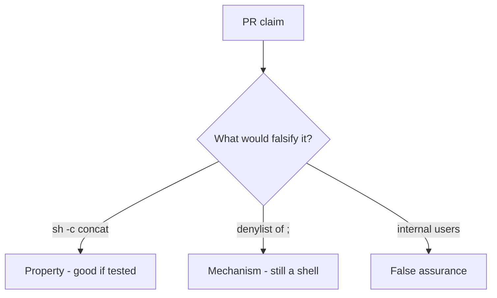

# 6.1-LO-08 — Review sh -c concatenation as a PR, not a CWE ticket

**Kind:** code-review
**Loop step:** Review
**Standards:** OWASP ASVS 5.0.0 (final) `v5.0.0-1.2.5`.

## Review the fixture as if it were SecureCollab export listing

Review `labs/6.1/6.1-lab/vulnerable/` as a SecureCollab PR. Intended findings live only in `content/assessment/keys/6.1.md` — not here.

## Mental model: shell=True or sh -c concatenation

Start with this seeded smell: **`shell=True` or `sh -c` concatenation**. Label it property, mechanism, or false assurance before you accept the PR.

Seeded smells (label them yourself; do not open the keys file):

- `shell=True` or `sh -c` concatenation
- Blacklist of `;` as the fix
- No `uses_shell` test
- Comment “user is trusted internally”

Also reject: live command execution, keys in lessons, metacharacter cookbooks.

## Misconceptions

- Injection is one CWE
- ORM/subprocess wrappers auto-escape shells
- Scanner finding is the invariant

## Practice

Write three review notes. Tie at least one to `test_does_not_invoke_shell`.

## Transfer

Clinic PR that “sanitized the filename” and still calls `sh -c` is incomplete.
