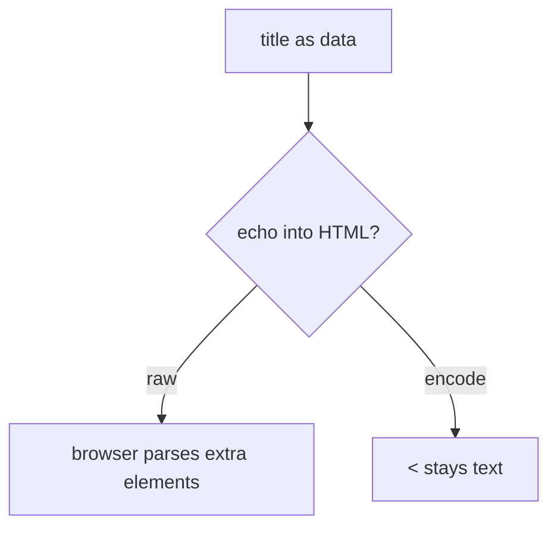
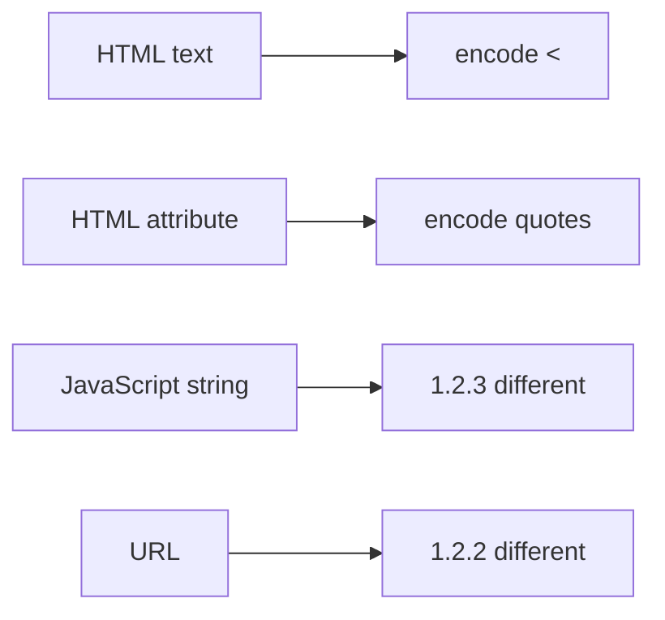

# 6.2-LO-01 — A title is data, not HTML grammar

**Kind:** concept-model
**Loop step:** 1 Property
**Standards:** OWASP ASVS 5.0.0 (final) `v5.0.0-1.2.1`, `v5.0.0-3.4.3`; `v5.0.0-3.4.7` is **Level 3, advanced**. W3C CSP3 and Trusted Types are **draft**. CWE-79 is *awareness after* the cause. React JSX is not this sentence.

## The claim this module owns

SecureCollab Phase 1 renders a note title in an HTML text context. **Angle brackets are data.** The browser must not parse an extra element. Module 6.1 taught data vs interpreter grammar; this module’s cell is the HTML parser.

> `render` must encode `<` as `&lt;` in HTML text. Encoding is context-specific. CSP is not this cell.

The forbidden outcome is **unencoded markup reaching the HTML interpreter**. That is a 1.1 integrity failure of the HTML document (and a confidentiality failure of sessions if combined with a 2.3 cookie that is not HttpOnly). This lab uses a tame marker (`<`), not an exploit kit.

ASVS `v5.0.0-1.2.1` wants context-relevant output encoding. `v5.0.0-3.4.3` wants a CSP with `object-src 'none'` and `base-uri 'none'` as a **layer**, not a substitute. `v5.0.0-3.4.7` (CSP reporting) is **Level 3, advanced**. CSP3 and Trusted Types remain **Working Draft**.

## Mental model: HTML grammar mixed with data



The attacker is a collaborator who can edit a title (stored), or anyone who can bounce a title through a reflected path. Trust is local `render()`. Real DOM sinks wait for later browser work; this fixture is a string.

**Mechanism (not the property):** a CSP header, a scanner “XSS” finding, or React defaults.

## Mental model: context is the encoding



HTML-text encoding is wrong in a JavaScript string. Attribute encoding is a different cell. `javascript:` / `data:` URLs are `v5.0.0-1.2.2`, not this lab.

## Root cause vs impact vs prevention vs detection vs recovery

| Slice | For this property |
|---|---|
| Root cause | HTML grammar mixed with data |
| Preconditions | `render` echoes `<` without encoding |
| Trigger | Title containing `<` (tame marker) |
| Impact | Integrity of the HTML interpreter |
| Prevention | Encode for HTML text; safe constructors; CSP extra |
| Detection | `stored_field_review`; CSP reports are extra |
| Recovery | Patch the renderer; rotate sessions if cookies were readable |

## Framework defaults versus the HTML guarantee

React JSX encodes text by default. `dangerouslySetInnerHTML` and a FastAPI HTML template do not. HttpOnly (2.3) does not stop script in the origin; it only hides the cookie from script.

## Mechanism limits

- HTML encoding is wrong in JS, CSS, or URL contexts.
- Markdown-to-HTML is a **second parser** (2.1).
- DOM clobbering and prototype pollution are named residuals.
- Trusted admin HTML is an explicit tiny exception, documented.

## Practice

Name the context (HTML text vs attr vs JS vs URL). Then run:

```
python3 -m pytest labs/6.2/6.2-lab/tests --impl vulnerable
python3 -m pytest labs/6.2/6.2-lab/tests --impl fixed
```

The first command must fail. The second must pass.

## Transfer

Clinic patient nickname. Markdown-to-HTML sanitizer as a second parser.

## Non-goals

Weaponized XSS payloads, live-target walkthroughs, dumping lab Python into notes. Gates 0–10 and milestones M0–M5 stay **not-attempted**. Answer keys are not in this file.
