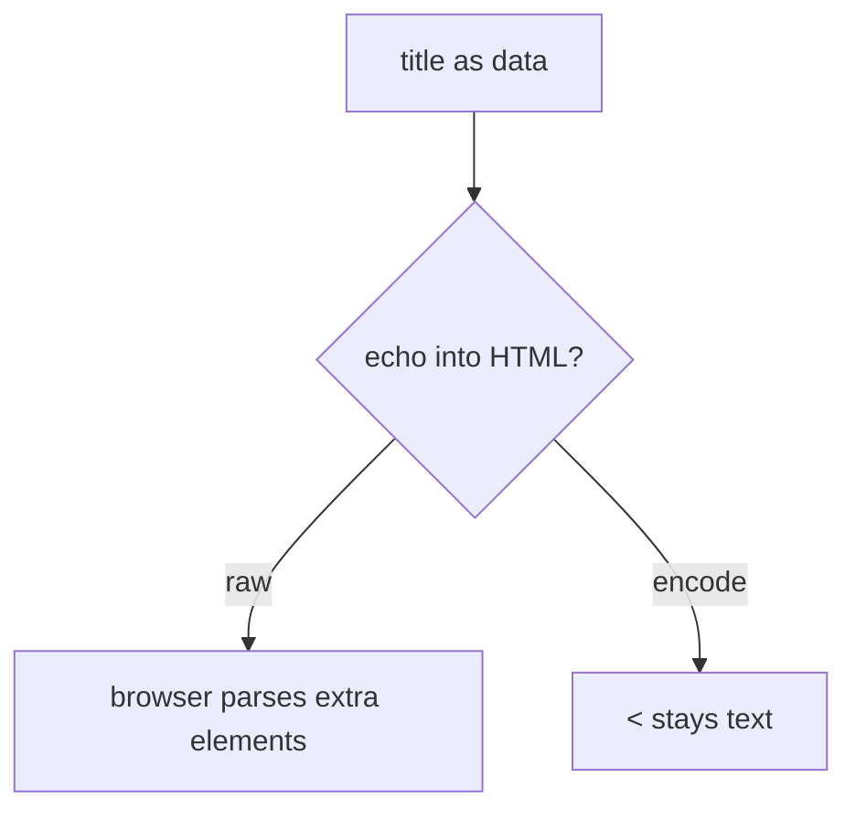
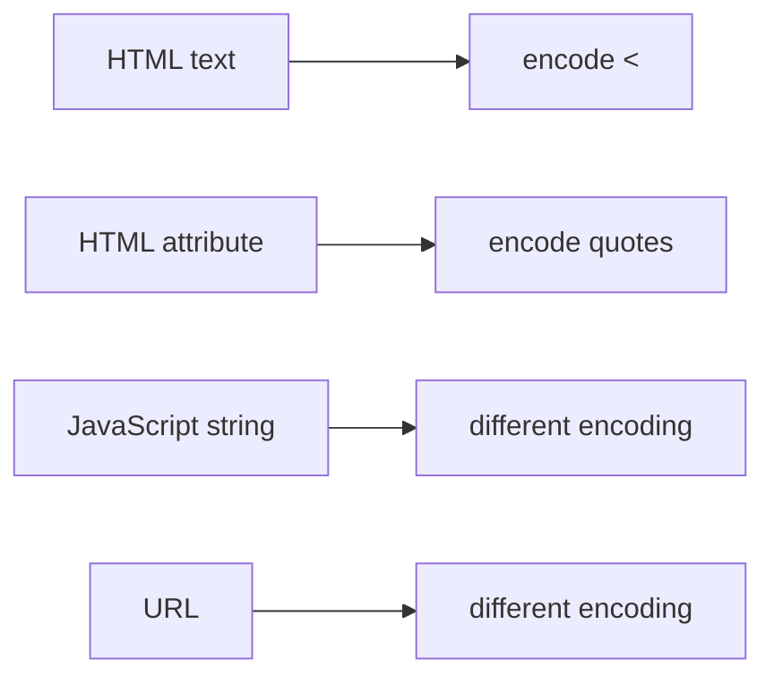

# A title is data, not HTML

**Kind:** concept-model
**Loop step:** 1 Property

## The rule

The notes app draws a note title as HTML text. The title is **data**. Angle brackets are data. The browser must not treat them as extra tags.

Last topic (6.1) taught data versus interpreter grammar. The rule is the HTML parser.

> `render` must turn `<` into `&lt;` when it writes HTML text. Encoding depends on where you write. A content-security header is not the encoding check.

Keep **unencoded markup** out of the HTML interpreter. That is an integrity failure of the HTML document. If the cookie is also readable by script (the cookie-jar topic, 2.3), it can become a secrecy failure of the session. This practice uses a tame marker (`<`). It is not an exploit kit. Do not paste attack recipes into notes.

Output has to be encoded for the context you are writing into. A content-security policy that blocks objects and base tags is a **layer**, not a substitute. Reporting from that policy is extra, later, and advanced. The current content-security spec and Trusted Types are still **draft**. A famous-bugs nickname for “script in HTML” is a family name after the cause, not the encoding check. React JSX is not the encoding check.

## Picture: HTML grammar mixed with data



The attacker is a collaborator who can edit a title (stored), or anyone who can bounce a title through a reflected path. What you trust is local `render()`. Real browser sinks wait for later work. This practice is a string.

A content-security header, a scanner finding labeled “XSS,” and React’s defaults do not encode angle brackets in the note body.

## Picture: context is the encoding



Encoding for HTML text is wrong inside a JavaScript string. Encoding for attributes is a different rule. `javascript:` and `data:` URLs are a different rule, not this practice.

## Why it happens, what it costs, how you stop it, how you notice, how you recover

| Slice | For this rule |
|---|---|
| Why it happens | HTML grammar mixed with data |
| What's already wrong | `render` echoes `<` without encoding |
| Trigger | A title that contains `<` (tame marker) |
| What it costs | Integrity of the HTML interpreter |
| How you stop it | Encode for HTML text; use safe constructors; content-security policy is extra |
| How you notice | `stored_field_review`; content-security reports are extra |
| How you recover | Patch the renderer; rotate sessions if cookies were readable by script |

## What the framework does vs what you still have to check

React JSX encodes text by default. `dangerouslySetInnerHTML` and a FastAPI HTML template do not. HttpOnly (2.3) does not stop script in the origin; it only hides the cookie from script.

`render` turns `<` into `&lt;` in HTML text — files in `labs/6.2/6.2-lab`. It is not a live page and not a public site.

## What the tool cannot do

- HTML-text encoding is wrong in JavaScript, CSS, or URL contexts.
- Markdown-to-HTML is a **second parser** (2.1).
- DOM clobbering and prototype pollution are named leftovers.
- Trusted admin HTML is an explicit tiny exception, written down — not a silent hole.

## Practice

Name the context (HTML text vs attribute vs JavaScript vs URL). Then run the local pair:

```text
python3 -m pytest labs/6.2/6.2-lab/tests --impl vulnerable
python3 -m pytest labs/6.2/6.2-lab/tests --impl fixed
```

Look at encoding at the HTML text sink, not a bug-list nickname.

## Use it somewhere new

A clinic patient nickname field. Markdown-to-HTML cleaner as a second parser.

## What this page is not doing

Do not use weaponized attack recipes, live-target walkthroughs, dumping practice Python into notes. Opening this page does not finish a check-in. Answer keys are not on this site.
