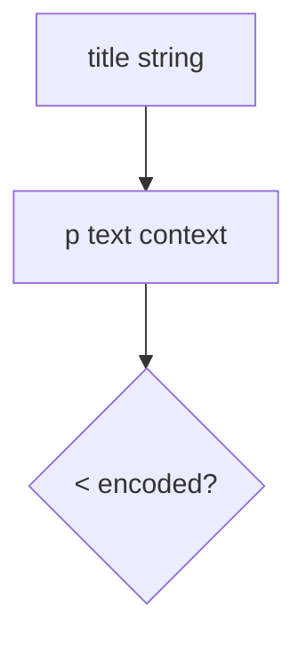
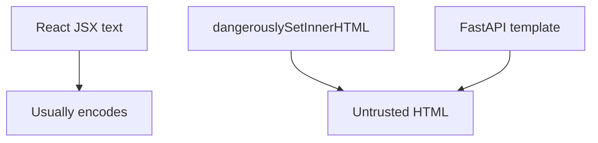

# 6.2-LO-02 — A context map a second engineer can test

**Kind:** design-exercise
**Loop step:** 2 Model
**Standards:** OWASP ASVS 5.0.0 (final) `v5.0.0-1.2.1`. CSP3 **draft**.

## Can a second engineer name pytest cases from your context map?

“We enabled CSP” is not this lesson. A reviewable model names **the sink, the context, and what encoding applies**.

SecureCollab Phase 1 freeze: local `render(body)` wrapping a `
` text node. No live DOM.

## Mental model: one sink, one context in this lab

Attribute, JS, and URL contexts are named holes, not this fixture.

## Mental model: React is not the TCB

Framework defaults help only at the constructors you actually use.

## Step 1: freeze pieces

| Piece | This system |
|---|---|
| Subjects | collaborator editing a title |
| Objects | HTML text vs markup |
| Actions | `render` |
| Channels | HTML document |
| TCB | HTML-text encoder |
| Untrusted | title / body string |
| State / time | stored title, later rendered |
| 1.1 cell | Integrity of the HTML interpreter |

## Step 2: write cells

| Subject | Object | Action | Decision |
|---|---|---|---|
| app | title | HTML text | encode `<` |
| attacker | title | as HTML grammar | deny |
| markdown | HTML | second parse | 2.1 residual |
| CSP | script loads | extra layer | draft, not this test |

## Practice

Draw text vs attr vs JS vs URL. Point at `labs/6.2/6.2-lab` file `html.py`.

## Transfer

Clinic nickname; markdown pipeline.

## Residual risk

Trusted admin HTML; CSP report-only; JS-context encoding (`v5.0.0-1.2.3`).

## Non-goals

Top 10 as the definition of security. Keys stay out of lessons.
