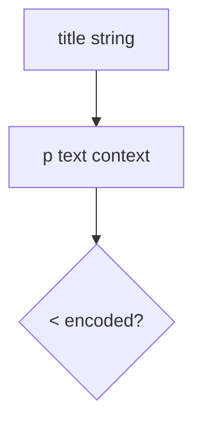
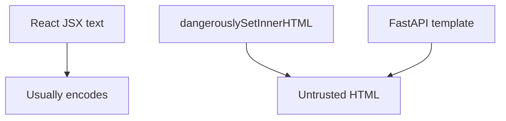

# A context map someone else can test

**Kind:** design-exercise
**Loop step:** 2 Model

## Could someone else name the checks from your map?

“We turned on a content-security policy” is not this lesson. A map someone else can test names **the sink, the context, and what encoding applies**.

This week’s freeze: the notes app’s local `render(body)` wrapping a `
` text node. No live page. No real browser.

## Picture: one sink, one context in this practice

Attribute, JavaScript, and URL contexts are named holes, not this fixture.

## Picture: React is not what you trust

Framework defaults help only at the constructors you actually use.

## Step 1: freeze the pieces

| Piece | This system |
|---|---|
| Who | Collaborator editing a title |
| What | HTML text vs markup |
| Actions | `render` |
| Paths | HTML document |
| What you trust | The HTML-text encoder |
| What you do not trust | The title / body string |
| Time | Stored title, later drawn |
| Integrity cell | Integrity of the HTML interpreter |

## Step 2: write cells the practice can fail

| Who | What | Action | Decision |
|---|---|---|---|
| app | title | HTML text | encode `<` |
| attacker | title | as HTML grammar | deny |
| markdown | HTML | second parse | 2.1 leftover |
| content-security policy | script loads | extra layer | draft, not this check |

## Practice

Draw text vs attribute vs JavaScript vs URL. Point at `labs/6.2/6.2-lab` file `html.py`. Label the sink as HTML text even in the repaired tree — the fix is encoding at that sink, not pretending a header became encoding.

## Use it somewhere new

Clinic nickname. Markdown pipeline.

## What can still go wrong

Trusted admin HTML. Content-security policy in report-only mode. Encoding for a JavaScript string (a different cell).

## What this page is not doing

Do not define security as a famous-bugs list. Answer keys stay out of lessons.
