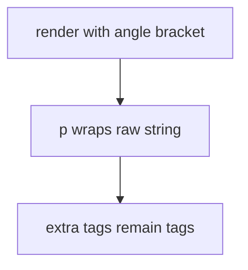

# Practice: unencoded markup reaches HTML

**Kind:** mechanism-lab
**Loop step:** 3 Break

## Try it

The practice is not a website you attack. It is a tiny Python model of drawing a title. The failure is already in the string: `render` leaves `<` as a tag delimiter, so extra tags stay in the output. Unencoded markup reaching HTML is **a failed rule**, not a trophy script.

> `render` must encode `<` as `&lt;` in HTML text. Unencoded markup must not reach the HTML interpreter.

## Where you may practice

Stay inside `labs/6.2/6.2-lab`. The practice is an in-process `render`. Fake titles only. It does not open a browser. Do not load a live page, an employer board, or a classmate preview as this exercise.

Do not paste this exercise onto a public site, employer board, or live clinic portal.

What must not happen: **unencoded markup reaches the HTML interpreter**. `render` leaves `<` as a tag delimiter, so the extra-tag marker `"<img"` remains in the output.

Who could do this: a member (or a stored title) who can supply a string containing `<`. That stands in for a clinic nickname on a shared board, or markdown left raw (2.1). What is supposed to stop this: `render` is supposed to encode for the **HTML text** context. A content-security header in report-only mode, cleaning after `innerHTML`, and React JSX defaults are not in what you trust for this rule.

## Picture: a raw angle bracket is already the break


```mermaid
flowchart TD
  Call["render with angle bracket"] --> Echo["p wraps raw string"]
  Echo --> Tag["extra tags remain tags"]
```

The broken files show **cause** (HTML grammar mixed with data). The tame marker is `<`. Do not paste attack recipes into notes. What has to be true first: `render` interpolates the body into `<p>…</p>` with no encoding. You do not need a live page. You must not.

A famous-bugs nickname for “script in HTML” is awareness after the cause, not this check.

## What to read in the broken files

`vulnerable/html.py` interpolates the body into `<p>…</p>` with no encoding. Checks:

- `test_angle_brackets_are_encoded`
- `test_honest_title_survives` — honest “Weekly notes” still appears

You do not need a new marker.
## Why it happens vs what it costs

| Slice | This practice |
|---|---|
| Required rule | `<` in a title becomes `&lt;` in HTML text |
| Why it happens | HTML grammar mixed with data |
| What has to be true first | `render` concatenates the body into a tag |
| Trigger | `render` of a string that contains `<` |
| What it costs | Integrity of the HTML document; then 2.3 if cookies are readable by script |
| How you stop it | Encode at the sink for this context; fail closed if you cannot |
| How you notice | `stored_field_review` by field name; never the title body if it is patient data |
| How you recover | Patch encoding; draw again; rotate cookies if they were readable by script |
| Not the lesson | A bug-list sticker, a content-security header, or an attack recipe |

## What the framework does vs what you still have to check

React JSX encodes text children by default; `dangerouslySetInnerHTML` does not. FastAPI `HTMLResponse` will ship whatever string you build. Jinja autoescape is off unless you turn it on. What this practice is supposed to show: the extra-tag marker `"<img"` is absent and `&lt;` is present.

## Practice

Run checks against the broken files (they **must fail** on unencoded markup). Record the check name `test_angle_brackets_are_encoded`.

```text
python3 -m pytest labs/6.2/6.2-lab/tests --impl vulnerable
```

Do not “fix” the check to pass. The failure *is* the evidence that the rule is currently false. Do not probe public hosts. A setup error is not proof the rule holds.

## Use it somewhere new

Clinic nickname. Predict without leaving this directory. Do not load a live board.

## What this page is not doing

No live-target steps. Fake titles only. Tame `<` is enough. Do not paste attack recipes.
