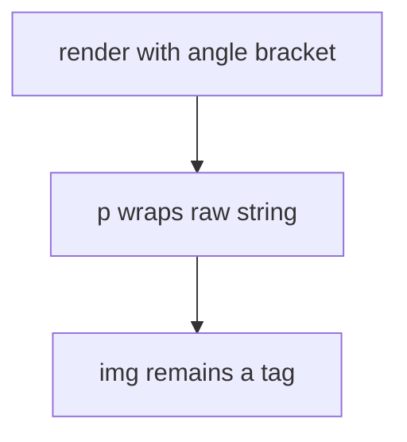

# 6.2-LO-03 — Observe encoding, do not trophy a script

**Kind:** mechanism-lab
**Loop step:** 3 Break
**Standards:** OWASP ASVS 5.0.0 (final) `v5.0.0-1.2.1`. CSP3 and Trusted Types are **draft**. `v5.0.0-3.4.7` is **Level 3, advanced**.

## Authorized scope

`labs/6.2/6.2-lab` only. The fixture is an in-process `render`. Synthetic titles. It does not open a browser. Do not load a live page, an employer board, or a classmate preview as this exercise.

**Forbidden outcome:** unencoded markup reaches the HTML interpreter. `render` leaves `<` as a tag delimiter so `"<img"` remains in the output.

Attacker capability in this lab: a member (or a stored title) who can supply a string containing `<`. That stands in for a clinic nickname on a shared board, or markdown left raw (2.1). Trust assumption: `render` is supposed to encode for the **HTML text** context. A CSP Report-Only header, sanitizing after `innerHTML`, and React JSX defaults are not in the TCB for this cell.

## Mental model: a raw angle bracket is already the break


```mermaid
flowchart TD
  Call["render with angle bracket"] --> Echo["p wraps raw string"]
  Echo --> Tag["img remains a tag"]
```

The vulnerable tree demonstrates **cause** (HTML grammar mixed with data). The tame marker is `<`. Do not paste exploit kits into notes. Preconditions: `render` interpolates the body into `<p>…</p>` with no encoding. You do not need a live DOM. You must not.

ASVS `v5.0.0-1.2.1` wants context-relevant output encoding. CWE-79 is awareness after the cause, not this oracle.

## What to read in the fixture

`vulnerable/html.py` interpolates the body into `<p>…</p>` with no encoding. Tests:

- `test_angle_brackets_are_encoded`
- `test_honest_title_survives` — honest “Weekly notes” still appears

You do not need a new marker. The failure of `test_angle_brackets_are_encoded` *is* the evidence.

Do not open the fixed tree yet. Diagnose the cause first.

## Root cause vs impact vs prevention vs detection vs recovery

| Slice | This lab |
|---|---|
| Required property | `<` in a title becomes `&lt;` in HTML text |
| Root cause | HTML grammar mixed with data |
| Preconditions | `render` concatenates the body into a tag |
| Trigger | `render` of a string that contains `<` |
| Impact | Integrity of the HTML document; then 2.3 if cookies are script-readable |
| Prevention | Encode at the sink for this context; fail closed if you cannot |
| Detection | `stored_field_review` by field name; never the title body if PHI |
| Recovery | Patch encoding; re-render; rotate cookies if they were script-readable |
| Not the lesson | A CWE-79 sticker, CSP header, or exploit kit |

## Framework defaults versus the HTML guarantee

React JSX encodes text children by default; `dangerouslySetInnerHTML` does not. FastAPI `HTMLResponse` will ship whatever string you build. Jinja autoescape is off unless configured. The application guarantee is: **this** fixture, `"<img"` is absent and `&lt;` is present.

## Practice

```text
python3 -m pytest labs/6.2/6.2-lab/tests --impl vulnerable
```

Record `test_angle_brackets_are_encoded`. Do not probe public hosts. An environment error is not security evidence.

## Transfer

Clinic nickname. Predict without leaving this directory. Do not load a live board.

## Non-goals

No live-target instructions. Synthetic titles only. Tame `<` is enough.
