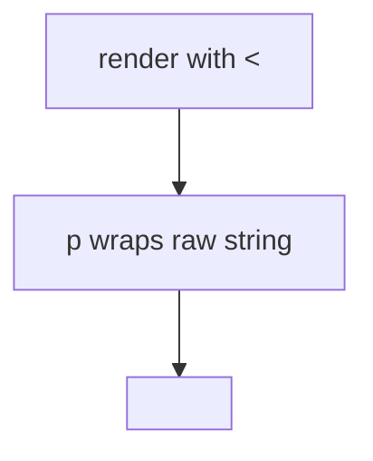

# 6.2-LO-03 — Observe encoding, do not trophy a script

**Kind:** mechanism-lab
**Loop step:** 3 Break
**Standards:** OWASP ASVS 5.0.0 (final) `v5.0.0-1.2.1`.

## Authorized scope

`labs/6.2/6.2-lab` only. Synthetic titles. No live browsers required.

**Forbidden outcome:** Unencoded markup reaches the HTML interpreter.

## Mental model: a raw angle bracket is already the break



The vulnerable tree demonstrates **cause** (HTML grammar mixed with data). The tame marker is `<`. Do not paste exploit kits into notes.

## What to read in the fixture

`vulnerable/html.py` interpolates the body into `<p>…</p>` with no encoding. Tests require that `<img` is absent and `&lt;` is present. Honest text “Weekly notes” must still appear.

## Root cause vs impact

| Slice | Lab |
|---|---|
| Root cause | HTML grammar mixed with data |
| Impact | Browser would parse extra elements |
| Not the lesson | A CWE-79 sticker as the definition |

## Practice

```
python3 -m pytest labs/6.2/6.2-lab/tests --impl vulnerable
```

Record `test_angle_brackets_are_encoded`. Do not probe public hosts.

## Transfer

Clinic nickname. Predict without leaving this directory.

## Non-goals

No live-target instructions. Synthetic data only.
