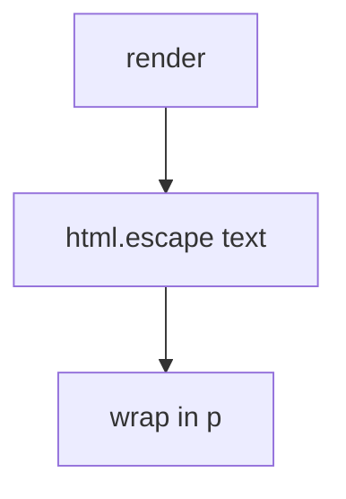

# 6.2-LO-04 — Encode for the HTML text context

**Kind:** design-exercise
**Loop step:** 4 Build
**Standards:** OWASP ASVS 5.0.0 (final) `v5.0.0-1.2.1`.

## Structural means the parser never sees extra tags

`render` must HTML-escape the body for a text context (`<` → `&lt;`). Structural means encoding at the sink — not a CSP Report-Only header, not sanitizing after `innerHTML`.

## Mental model: escape, then wrap



Fail-safe: if you cannot encode for this context, **do not render HTML**.

## Why this restores the cell

| After the fix | Must be true |
|---|---|
| body containing `<` | `&lt;` present, `<img` absent |
| honest “Weekly notes” | still visible as text |

## What this is not

CSP as the fix. Sanitizer after assignment to `innerHTML`. Encoding for the wrong context (JS string, URL). Markdown left raw.

## Practice

Name the predicate. Run:

```
python3 -m pytest labs/6.2/6.2-lab/tests --impl fixed
```

Must pass.

## Transfer

Clinic: encode the nickname in HTML text; treat markdown as a second parser.

## Residual risk

Attribute/JS/URL contexts; Trusted Types **draft**; `v5.0.0-3.4.7` Level 3 reporting advanced; trusted admin HTML exception.
