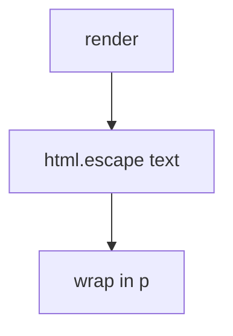

# Encode for the HTML text context

**Kind:** design-exercise
**Loop step:** 4 Build

## The rule

A report-only content-security header does not encode the note. Cleaning after `innerHTML` is late. “React will handle it” is a slogan.

Do this: the parser **never sees extra tags**. `render` must HTML-escape the body for a text context (`<` → `&lt;`). Encode at the sink.

Restore the notes app’s title HTML with this: escape, then wrap. Fail-safe: if you cannot encode for this context, **do not draw HTML**. Do not count it as a pass because a content-security policy is “on.”

## Picture: escape, then wrap



`render` is `html.escape(body, quote=True)` then wrap in `<p>`. Attribute, JavaScript, and URL contexts remain leftover encodings. Markdown is a second parser (2.1). A content-security policy that blocks objects and base tags is a layer after encoding, not a substitute.

Output has to be encoded for the context you are writing into — HTML text.

## What the repaired files must show

| After the fix | Must be true |
|---|---|
| body containing `<` | `&lt;` present, extra-tag marker `"<img"` absent |
| honest “Weekly notes” | still visible as text |

If you cannot encode for this context, **do not draw HTML**. Do not keep the raw string because “the header will catch it.”

## What this is not

- A content-security policy as the fix.
- A cleaner after assignment to `innerHTML`.
- Encoding for the wrong context (JavaScript string, URL).
- Markdown left raw.
- HttpOnly as “script in the page is harmless.”

## What the tool cannot do

- Attribute, JavaScript, and URL contexts need different encoding.
- Trusted Types remain **draft**.
- Content-security reporting is extra, advanced, not enforcement.
- A trusted-admin HTML exception must be named, not silent.
- Markdown-to-HTML is 2.1’s second parser.

## Practice

Name the check (`&lt;` present, extra-tag marker `"<img"` absent, honest title survives). Run `--impl fixed` (must pass):

```text
python3 -m pytest labs/6.2/6.2-lab/tests --impl fixed
```

## Use it somewhere new

Encode the nickname in HTML text; treat markdown as a second parser.

## What can still go wrong

Attribute / JavaScript / URL contexts. Trusted Types still draft. Content-security reporting as extra, not this check. Trusted admin HTML. Cookie flags (2.3).

## What this page is not doing

Do not paste attack recipes. Do not claim Gate 6 from a content-security header.
