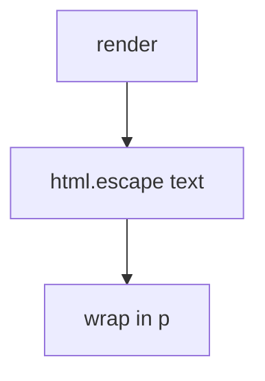

# 6.2-LO-04 — Encode for the HTML text context

**Kind:** design-exercise
**Loop step:** 4 Build
**Standards:** OWASP ASVS 5.0.0 (final) `v5.0.0-1.2.1`. `v5.0.0-3.4.3` CSP is a **layer**. `v5.0.0-3.4.7` reporting is **Level 3, advanced**. CSP3 / Trusted Types are **draft**.

## Structural means the parser never sees extra tags

`render` must HTML-escape the body for a text context (`<` → `&lt;`). Structural means encoding at the sink — not a CSP Report-Only header, not sanitizing after `innerHTML`, not “React will handle it.”

The smallest restore for SecureCollab Phase 1 title HTML is: escape, then wrap. Fail-safe: if you cannot encode for this context, **do not render HTML**. Do not fail open because CSP is “on.”

## Mental model: escape, then wrap



The lab’s fixed tree uses `html.escape(body, quote=True)` then wraps in `<p>`. Production still needs encoding for attribute, JavaScript, and URL contexts (`v5.0.0-1.2.3` and neighbors) as residuals. Markdown is a second parser (2.1). CSP `object-src 'none'` / `base-uri 'none'` (`v5.0.0-3.4.3`) is a layer after encoding, not a substitute.

ASVS `v5.0.0-1.2.1` wants context-relevant output encoding. This pytest is that sentence for HTML text.

## Why this restores the cell

| After the fix | Must be true |
|---|---|
| body containing `<` | `&lt;` present, `"<img"` absent |
| honest “Weekly notes” | still visible as text |

## What this is not

CSP as the fix. Sanitizer after assignment to `innerHTML`. Encoding for the wrong context (JS string, URL). Markdown left raw. HttpOnly as “XSS is harmless.”

## Mechanism limits

- Attribute, JS, and URL contexts need different encoding.
- Trusted Types remain **Working Draft**.
- CSP reporting (`v5.0.0-3.4.7`) is Level 3 advanced, not enforcement.
- A trusted-admin HTML exception must be named, not silent.
- Markdown-to-HTML is 2.1’s second parser.

## Practice

Name the predicate (`&lt;` present ∧ `"<img"` absent ∧ honest title survives). Run:

```text
python3 -m pytest labs/6.2/6.2-lab/tests --impl fixed
```

Must pass.

## Transfer

Clinic: encode the nickname in HTML text; treat markdown as a second parser.

## Residual risk

Attribute/JS/URL contexts; Trusted Types draft; CSP reporting Level 3; trusted admin HTML; 2.3 cookie flags.

## Non-goals

Do not paste exploit kits. Do not claim Gate 6 from a CSP header.
