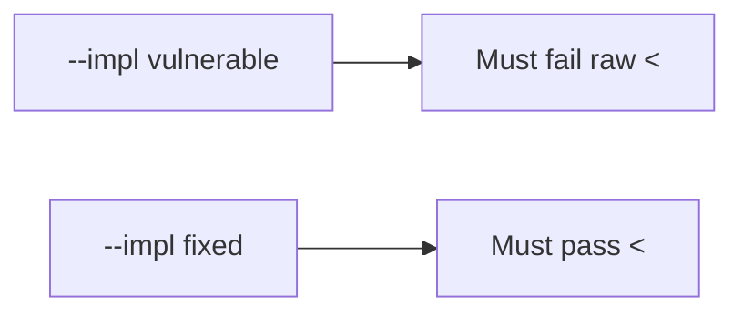

# 6.2-LO-05 — Evidence is encoded angle brackets, then a passing pair

**Kind:** verification-lab
**Loop step:** 5 Verify
**Standards:** OWASP ASVS 5.0.0 (final) `v5.0.0-1.2.1`.

## An invariant that cannot fail a test is still a slogan

“We added CSP” is not evidence. The oracle is the local pair.

## Mental model: fail-on-vulnerable, pass-on-fixed



| Case | Must show |
|---|---|
| Negative / abuse | `<` becomes `&lt;`; extra tags absent |
| Normal | honest title still present |
| Not claimed | attribute/JS/URL contexts; live DOM XSS; CSP enforcement |

```
python3 -m pytest labs/6.2/6.2-lab/tests --impl vulnerable
python3 -m pytest labs/6.2/6.2-lab/tests --impl fixed
```

Honest titles may pass on both.

## What the tests do not prove

- JavaScript-context encoding (`v5.0.0-1.2.3`)
- CSP (`v5.0.0-3.4.3`) or reporting Level 3 (`v5.0.0-3.4.7`)
- Trusted Types (**draft**)
- Markdown sanitizer (2.1)

## Practice

Execute both implementations. Map each test to an LO-02 cell.

## Transfer

Clinic nickname. A test that only asserts HTTP 200 is not this cell.
