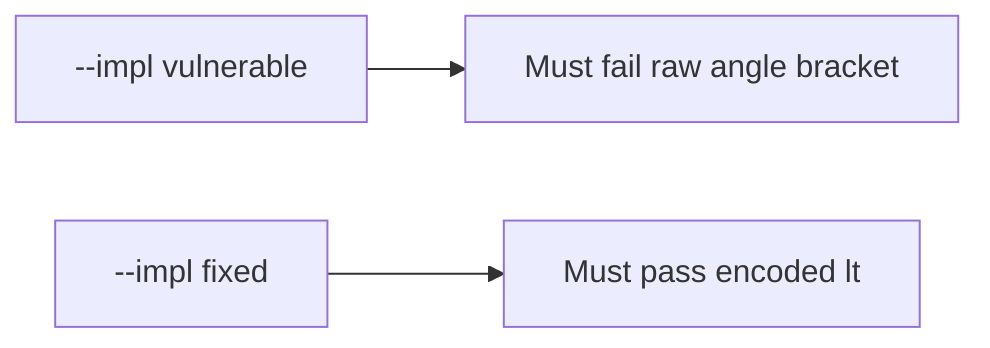

# The broken files must fail on a raw less-than

**Kind:** verification-lab
**Loop step:** 5 Verify

## Check it

Adding a content-security header does not encode the note. A React import is a library. `render` of a string containing `<` has to include `&lt;` and must not include the extra-tag marker `"<img"`. The leftover build: the raw `<` remains. Repair encodes `<` as `&lt;`.

## Picture: broken files must fail: raw <

Unencoded markup can still reach HTML while the suite stays green.



If the broken renderer still passes, encoding was never the assertion.

## What the check has to show

| Mode | Must show for this topic |
|---|---|
| Normal | Honest title still present (`test_honest_title_survives`; may pass on both) |
| Wrong input / abuse | `<` becomes `&lt;`; extra tags absent; broken files must fail |
| Not claimed | Attribute / JavaScript / URL contexts; live page attacks; content-security enforcement |

Unencoded markup keeps `test_angle_brackets_are_encoded` red (`labs/6.2/6.2-lab/tests/test_property.py`). The tame marker is enough; do not add an attack recipe to the check.

```text
python3 -m pytest labs/6.2/6.2-lab/tests --impl vulnerable
python3 -m pytest labs/6.2/6.2-lab/tests --impl fixed
```

An honest title may survive on both sides. You still have to encode `<`. If the broken files do not fail `"<img" not in out`, the practice is miswired — fix the wiring, not the check.

## What the checks do not prove

- Encoding for a JavaScript string (a different rule)
- Content-security policy, or reporting from it (extra, advanced)
- Trusted Types (**draft**)
- A markdown cleaner (2.1)
- HttpOnly cookies (2.3)

## Practice

Call `render`. A `Content-Security-Policy` header is the policy name, not the encoded note. A setup error is not proof the rule holds.

## Use it somewhere new

A saved nickname can still echo raw `<`. Do not run a check that loads a live board.

## What this page is not doing

Do not add an attack recipe. Do not log title bodies if they are patient data. Answer keys are not on this site.
