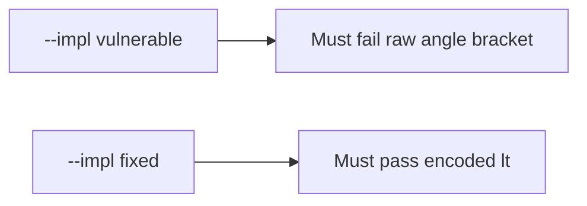

# 6.2-LO-05 — Evidence is encoded angle brackets, then a passing pair

**Kind:** verification-lab
**Loop step:** 5 Verify
**Standards:** OWASP ASVS 5.0.0 (final) `v5.0.0-1.2.1`.

## An invariant that cannot fail a test is still a slogan

“We added CSP” is not evidence. “React is on” is a mechanism observation. The oracle is: `render` of a string containing `<` has `&lt;` and does not contain `"<img"`. That observation must be **false** on `--impl vulnerable` (raw `<` remains) and **true** on `--impl fixed`.

## Mental model: vulnerable must fail: raw <

The failing observation on `--impl vulnerable` is **raw <**. A passing collection count is not this cell.



| Mode | Must show for this module |
|---|---|
| Normal | honest title still present (`test_honest_title_survives`; may pass on both) |
| Negative / abuse | `<` becomes `&lt;`; extra tags absent; vulnerable must fail |
| Not claimed | attribute/JS/URL contexts; live DOM XSS; CSP enforcement |

Lab tests in `labs/6.2/6.2-lab/tests/test_property.py`. `test_angle_brackets_are_encoded` is a **forbidden-outcome** test: unencoded markup is not allowed to count as a passing control. The tame marker is enough; do not add an exploit kit to the test.

```text
python3 -m pytest labs/6.2/6.2-lab/tests --impl vulnerable
python3 -m pytest labs/6.2/6.2-lab/tests --impl fixed
```

Honest titles may pass on both implementations. That does not excuse the encode test. If vulnerable does not fail `"<img" not in out`, the lab is miswired—fix the wiring, not the assertion.

## What the tests do not prove

- JavaScript-context encoding (`v5.0.0-1.2.3`)
- CSP (`v5.0.0-3.4.3`) or reporting Level 3 (`v5.0.0-3.4.7`)
- Trusted Types (**draft**)
- Markdown sanitizer (2.1)
- HttpOnly cookies (2.3)

Record those as residuals or later modules, not as silent passes.

## Practice

Execute both implementations this session. Write the fail/pass pair next to the matrix row. Reject a “test” that only greps `Content-Security-Policy` without calling `render`.

## Transfer

Clinic nickname. A test that only asserts HTTP 200 is not this cell (see 9.3). A test that loads a live board is out of scope.

## Non-goals

Do not add an exploit kit. Do not log title bodies if they are PHI. Keys stay out of this file.
