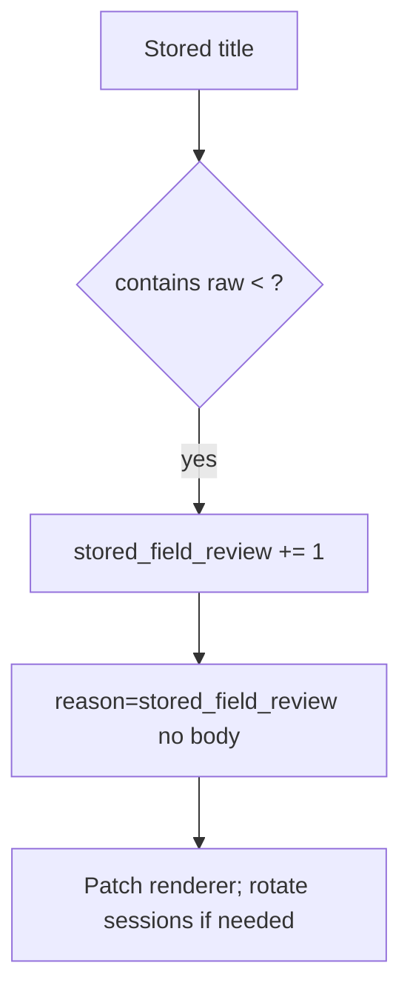

# 6.2-LO-06 — Detect stored_field_review; CSP reports are extra

**Kind:** operations-exercise
**Loop step:** 6 Operate
**Standards:** NIST CSF 2.0 (final) DE/RS/RC as outcome labels; OWASP ASVS 5.0.0 (final) `v5.0.0-1.2.1`. `v5.0.0-3.4.7` Level 3 is **advanced**. CSP3 **draft**.

## Prevention is not absolute

A markdown path can reintroduce raw HTML. Pair detect and recover. Do not log title bodies if they are PHI (3.1).

## Mental model: stored field is a signal



| Outcome | This module |
|---|---|
| Detect | `stored_field_review`; `csp_report` is extra, not enforcement |
| Signal | request id, field name; never the title body if PHI |
| Recover | Patch encoding; re-render; rotate cookies if they were script-readable |
| Residual | Report-Only CSP; trusted admin HTML |

## Practice

Write one log line you would accept. Tie it to `labs/6.2/6.2-lab`.

```
log_denied reason=stored_field_review field=title request_id=req_62h
```

Reject any line that includes the title text, a note body, or a payload cookbook.

## Transfer

Clinic: detect nickname fields with raw `<`; do not paste nicknames into the ticket.

## Non-goals

A WAF product name is not the property. CSP Report-Only is not this cell’s enforcement.
