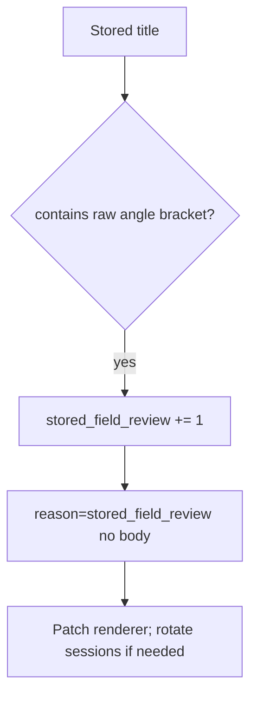

# Notice stored-field review; CSP reports are extra

**Kind:** operations-exercise
**Loop step:** 6 Operate

## Stopping it is not enough

A markdown path can bring raw HTML back after `render` was “fixed once.” Pair notice and recover. Do not log title bodies if they are patient data (3.1). Do not paste nicknames into the ticket.

## Picture: stored field is a signal



Industry lists name detect, respond, recover. They do not encode HTML. They do not prove a checklist. Someone still has to own the leftover.

## Signals that do not become a second leak

| Outcome | This topic |
|---|---|
| Notice | `stored_field_review`; `csp_report` is extra, not enforcement |
| What the line holds | request id, field name; never the title body if it is patient data |
| Recover | Patch encoding; draw again; rotate cookies if they were readable by script |
| Leftover | Report-only content-security policy; trusted admin HTML |

A filter-product name is not the rule. Re-run `test_angle_brackets_are_encoded` after any renderer change; a green “content-security policy on” tile is not that pytest. Markdown and nickname fields are other paths of the same cell — list them before you claim Recover.

## What the framework does vs what you still have to check

A content-security report-only dashboard will page on blocked scripts and stay silent when the stored title still contains raw `<`. Notice must observe **raw angle brackets at the encode sink**, not report-only counts. If the alert includes the title text, you have opened a logging leak (3.1).

The app’s promise is: **this** practice, a stored-field review fires without the title body, and a content-security report is extra, not this week’s enforcement.

## Practice

Write one log line you would accept in review. Tie it to `labs/6.2/6.2-lab`. Example shape (fake ids only):

```text
log_denied reason=stored_field_review field=title request_id=req_62h
```

Reject any line that includes the title text, a note body, or an attack cookbook.

## Use it somewhere new

Clinic: notice nickname fields with raw `<`; do not paste nicknames into the ticket. Do not load a live board.

## What this page is not doing

A filter-product name is not the rule. Content-security policy in report-only mode is not this cell’s enforcement. Live attack hunts are out of scope. Gates 0–10 stay not-attempted.
