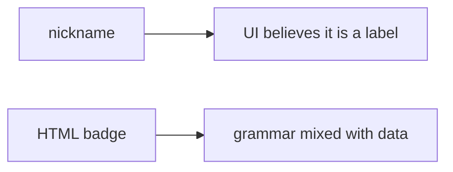

# 6.2-LO-07 — Transfer: clinic patient nickname field

**Kind:** transfer-challenge
**Loop step:** 7 Transfer
**Standards:** OWASP ASVS 5.0.0 (final) `v5.0.0-1.2.1`. CSP3 **draft**.

## Change the workplace; keep context encoding

Do not answer with a Top 10 / CWE / scanner as the definition of security. The SecureCollab sentence was: `render` encodes `<` as `&lt;` in HTML text. Rewrite it for a clinic without changing the fork.

**Prompt:** Clinic patient nickname field rendered on a shared board. Also name markdown-to-HTML as a second parser (2.1).

**Product sketch:** EHR-lite “preferred name” that concatenates into an HTML badge.

Rewrite the SecureCollab sentence. Include:

1. attacker capabilities (patient or clerk supplying a nickname — not a live clinic);
2. trust assumptions (HTML-text encoder is TCB; CSP header is not);
3. forbidden outcome (`render` leaves `<` as markup, not “HIPAA”);
4. a test idea on a **local** fixture only (tame `<` marker);
5. residual (JS/attr/URL contexts; markdown pipeline; Trusted Types draft; CSP reporting Level 3);
6. WCAG if a human “name could not be shown” path is in the claim (readable fallback, not a blank badge that hides the person).

## Mental model: nickname is still HTML input

If the nickname is concatenated into an HTML badge, the cell is gone. FastAPI, a CSP Report-Only header, and React defaults on a different component do not encode this sink. Markdown-to-HTML is 2.1’s second parser: even a well-encoded badge fails if markdown emits raw tags later. Trusted Types remain draft.

The clinic rewrite still has to keep the SecureCollab fork: `<` in the nickname becomes `&lt;` in the badge text. Adding CSP without an encode test leaves the HTML interpreter mixed. The local pytest analogue is `test_angle_brackets_are_encoded` — on a fixture, not a live board.

## What graders reject

| Reject | Why |
|---|---|
| “CSP is on” | Layer, draft, not this cell |
| Live clinic probe | Lab policy |
| Exploit-kit payload as the test | Lab policy; tame `<` is enough |
| HTTP 200 as encoding evidence | Wrong observation |
| HttpOnly as XSS done | Different cell (2.3) |

## Practice

One page. No keys. `labs/6.2/6.2-lab` is the only running system you may break. Do not load a live board or paste exploit kits.

## Non-goals

Live-target XSS. Real nicknames as PHI dumps. Claiming Gate 6 from this page.
