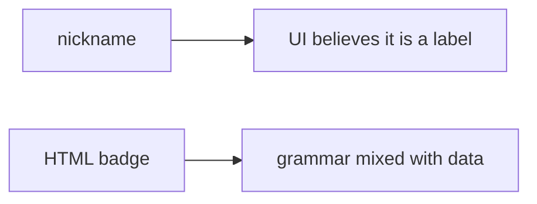

# Same idea on a clinic nickname field

**Kind:** transfer-challenge
**Loop step:** 7 Transfer

## Use it somewhere new

You get a **clinic patient nickname** field drawn on a shared board. Also name markdown-to-HTML as a second parser (2.1).

On the notes app, `render` encodes `<` as `&lt;` in HTML text.

**Product sketch:** an EHR-lite “preferred name” that concatenates into an HTML badge.

## Picture: nickname is still HTML input

Calling it “nickname” instead of “title” does not move the work. If the nickname is concatenated into an HTML badge, the rule is gone. FastAPI, a content-security header in report-only mode, and React defaults on a different component do not encode this sink. Markdown-to-HTML is 2.1’s second parser: even a well-encoded badge fails if markdown emits raw tags later. Trusted Types remain draft.

| Notes app this week | Clinic sketch |
|---|---|
| Collaborator editing a title | Patient or clerk supplying a nickname — not a live clinic |
| `render` of a title into `
` text | Preferred name concatenated into an HTML badge |
| HTML-text encoder is what you trust | Same; a content-security header is not |
| Markdown leftover | Markdown-to-HTML as a second parser (2.1) |

## Write this for a clinic nickname field

1. who can act (patient or clerk supplying a nickname — not a live clinic);
2. what you trust (the HTML-text encoder is what you trust; a content-security header is not);
3. what must not happen (`render` leaves `<` as markup, not “HIPAA”);
4. a check idea on **local** practice files only (tame `<` marker);
5. leftover risk (JavaScript / attribute / URL contexts; markdown pipeline; Trusted Types draft; content-security reporting as extra, advanced);
6. the web accessibility baseline if a human “name could not be shown” path is in the claim (readable fallback, not a blank badge that hides the person).

`<` in the nickname becomes `&lt;` in the badge text. Adding a content-security policy without an encode check leaves the HTML interpreter mixed. The local check is `test_angle_brackets_are_encoded` — on a practice, not a live board.

## What is not good enough

| Reject | Why |
|---|---|
| “Content-security policy is on” | Layer, draft, not this rule |
| Live clinic probe | Course rules |
| Attack-recipe payload as the check | Course rules; tame `<` is enough |
| HTTP 200 as encoding evidence | Wrong observation |
| HttpOnly as “script in the page is done” | A different rule (2.3) |

## Practice

One page. No keys. `labs/6.2/6.2-lab` is the only running system you may break. Do not load a live board or paste attack recipes.

## What this page is not doing

Do not try live-target attacks. Do not use real nicknames as patient-data dumps. This page does not finish a check-in.
