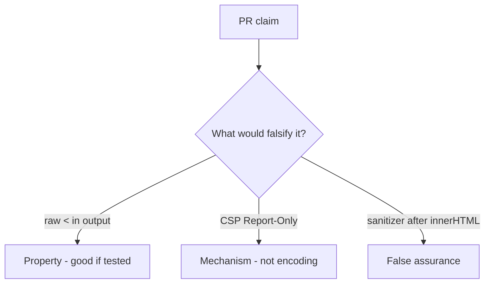

# 6.2-LO-08 — Review unencoded title HTML as a PR, not an XSS ticket

**Kind:** code-review
**Loop step:** Review
**Standards:** OWASP ASVS 5.0.0 (final) `v5.0.0-1.2.1`.

## Review the fixture as if it were SecureCollab HTML rendering

Review `labs/6.2/6.2-lab/vulnerable/` as a SecureCollab PR. Intended findings live only in `content/assessment/keys/6.2.md` — not here.

## Mental model: property, mechanism, or false assurance

Seeded smells (label them yourself; do not open the keys file):

- Template concatenates title
- CSP Report-Only as the fix
- No `&lt;` test
- Sanitizer after `innerHTML` assignment

Also reject: exploit-kit payloads in the PR description, keys in lessons.

## Misconceptions

- CSP replaces encoding
- HttpOnly makes XSS harmless
- Markdown is inert

## Practice

Write three review notes. Tie at least one to `test_angle_brackets_are_encoded`.

## Transfer

Clinic PR that “added CSP” without an encode test is incomplete.
