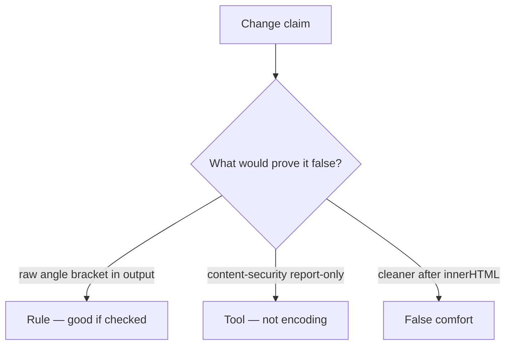

# Review of an unencoded title

**Kind:** code-review
**Loop step:** Review

Intended findings live only in the answer-key folder — not here. Do not open that file until your review has been evaluated.

## What you are reviewing

A colleague ships the notes app’s HTML drawing. Review `labs/6.2/6.2-lab/vulnerable/` as that change. Your job is not to count suspicious lines. Reconstruct whether `render` still leaves `<` as markup, compare that with the rule, and write changes a developer can verify.

The check you already ran (`test_angle_brackets_are_encoded`) is the rule check. A comment “we should encode later” is not.

## Picture: template concatenates title

Start with this seeded smell: **template concatenates title**. Label it **rule**, **tool**, or **false comfort** before you accept the change.

Hold onto `&lt;` present, extra tags absent. If that sink is missing encoding, you still have a grammar mix. A content-security header in report-only mode without an encode check is still the same problem.

A markdown pipeline that emits raw tags after this template is encoded is 2.1, not a reason to skip `test_angle_brackets_are_encoded`. HttpOnly cookies (2.3) do not encode HTML.

## Seeded smells (label them yourself)

- Template concatenates title
- Content-security policy in report-only mode as the fix
- No `&lt;` check
- Cleaner after `innerHTML` assignment

Also reject: attack-recipe payloads in the change description; closing findings without re-running `test_angle_brackets_are_encoded`; keys in learner notes.

## Common mix-ups this topic refuses

- A content-security policy replaces encoding
- HttpOnly makes script in the page harmless
- Markdown is inert
- React everywhere means this template is encoded
- A famous-bugs nickname is the rule

## Practice

Write three review notes a peer could act on. Each note: what you saw, rule or false comfort, suggested structural change, leftover you will **not** delete. Tie at least one note to `test_angle_brackets_are_encoded`. Do not open the keys file.

## Use it somewhere new

A clinic change that “added a content-security policy” without an encode check is an incomplete review. Name the independent falsehood that would still keep `<` from remaining markup.

## What this page is not doing

Do not merge by adding a comment “will encode later.” That comment is leftover without an owner. Do not load a live page to prove the finding.
