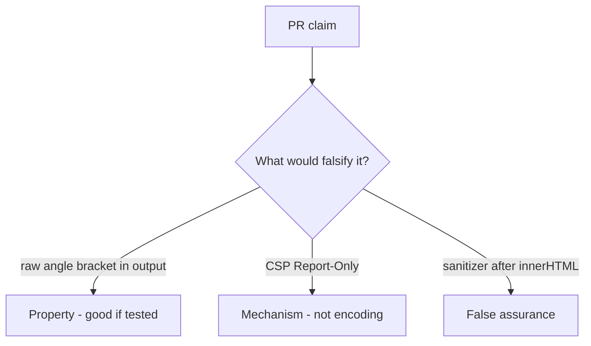

# 6.2-LO-08 — Review unencoded title HTML as a PR, not an XSS ticket

**Kind:** code-review
**Loop step:** Review
**Standards:** OWASP ASVS 5.0.0 (final) `v5.0.0-1.2.1`.

## Review the fixture as if it were SecureCollab HTML rendering

Review `labs/6.2/6.2-lab/vulnerable/` as a SecureCollab PR. Your job is not to count suspicious lines. Reconstruct whether `render` still leaves `<` as markup, compare that with the module invariant, and write changes a developer can verify.

Intended findings live only in `content/assessment/keys/6.2.md` — not here. Do not open the keys file until your review has been evaluated.

## Mental model: Template concatenates title

Start with this seeded smell: **Template concatenates title**. Label it property, mechanism, or false assurance before you accept the PR.

Classification starts at the protected effect (`&lt;` present, extra tags absent). Everything that is not encoding at that sink is a candidate grammar mix. CSP Report-Only without an encode test is the same smell, not a different finding class.

A markdown pipeline that emits raw tags after this template is encoded is 2.1, not a reason to skip `test_angle_brackets_are_encoded`. HttpOnly cookies (2.3) do not encode HTML.

## Seeded smells (label them yourself)

- Template concatenates title
- CSP Report-Only as the fix
- No `&lt;` test
- Sanitizer after `innerHTML` assignment

Also reject: exploit-kit payloads in the PR description; closing findings without re-running `test_angle_brackets_are_encoded`; keys in lessons.

## Misconceptions this module refuses

- CSP replaces encoding
- HttpOnly makes XSS harmless
- Markdown is inert
- React everywhere means this template is encoded
- CWE-79 is the property

## Practice

Write three review notes a maintainer could act on. Each note: observation, property or false assurance, suggested structural change, residual you will **not** delete. Tie at least one to `test_angle_brackets_are_encoded`.

## Transfer

Clinic PR that “added CSP” without an encode test is an incomplete mediation review. Name the independent falsehood that would still keep `<` from remaining markup.

## Non-goals

Do not merge by adding a comment “will encode later.” That comment is a residual without an owner. Do not load a live page to prove the finding.
