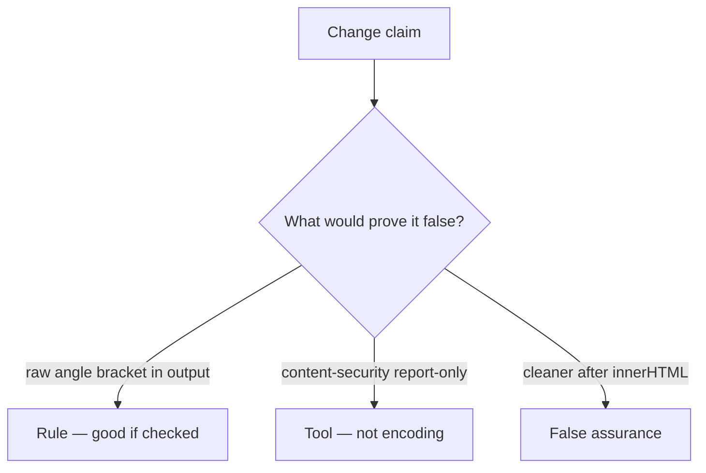

# Review of an unencoded title

**Kind:** code-review
**Loop step:** Review

## What you are reviewing

The files in `labs/6.2/6.2-lab/vulnerable/` are the HTML-drawing change. Does `render` still leave `<` as markup?

If `test_angle_brackets_are_encoded` still fails, “we should encode later” is unfinished work.

## Picture: template concatenates title

**template concatenates title**.

`&lt;` is present, extra tags are absent. If that sink never encodes, that grammar mix is still open. A content-security header in report-only mode without an encode check is still the same problem.

A markdown pipeline that emits raw tags after this template is encoded is 2.1, not a reason to skip `test_angle_brackets_are_encoded`. HttpOnly cookies (2.3) do not encode HTML.

## Problems to find (name them yourself)

- Template concatenates title
- Content-security policy in report-only mode as the fix
- No `&lt;` check
- Cleaner after `innerHTML` assignment

Also reject: attack-recipe payloads in the change description; closing findings without re-running `test_angle_brackets_are_encoded`; keys in learner notes.

## Common mix-ups this topic refuses

- A content-security policy replaces encoding
- HttpOnly makes script in the page harmless
- Markdown is inert
- React everywhere means this template is encoded
- A CWE name encodes HTML

## Use it somewhere new

A content-security policy without an encode check still leaves `<` as markup. What still has to encode `<` even if a content-security policy is set?

## What this page is not doing

Someone still has to encode angle brackets; “will encode later” does not do that. Do not load a live page to prove the finding.
