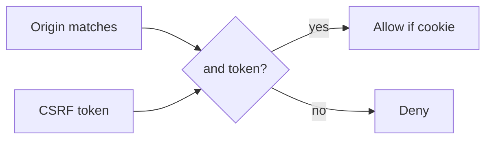

# Leftover cookies are not consent to share

**Kind:** concept-model
**Loop step:** 1 Property

## The rule

The notes app already treats a share as a grant. Sharing a note is a **change that writes a grant**. A leftover session cookie is leftover permission from login. The browser will attach that cookie to a request the person did not aim at this site. That cookie is leftover authority. It is not consent to share.

> `allow_share` from a foreign origin without a matching CSRF token must be false. Leftover cookies are not consent.

What must not happen is **a cross-site POST that changes a share, authorized by cookie alone**. That is an integrity failure of share grants: an unwanted share, with the browser acting as a helper that sent the leftover cookie.

Use an anti-forgery token, or an extra header that a simple cross-site form cannot set, when a CORS preflight is not the defense. Changes should use unsafe methods (not GET), or a strict fetch-metadata check. SameSite still has to match the cookie’s purpose — a helper, not the whole rule. Extra rows about authenticated embeds and CORP are **advanced**, not this check.

## Picture: leftover cookie authority without site-bound intent


Picture a foreign origin that can cause the victim’s browser to send the leftover cookie. What you trust is local `allow_share(origin, expected, token)`. Do not visit other people’s sites.

SameSite=Lax, a CORS `*` reflex, or “JSON APIs cannot CSRF” is not this check.

## Picture: origin and token and method



A token you put on `Authorization` by hand is a **different helper**. It does not ride along on a form POST from another site. A leftover cookie does. A GET that still changes a share is a leftover hole.

## Why it happens, what it costs, how you stop it, how you notice, how you recover

| Slice | For this rule |
|---|---|
| Why it happens | Cookie authority used without site-bound intent |
| What's already wrong | `allow_share(evil, app, token=None)` is true |
| Trigger | Foreign-origin POST with leftover cookie |
| What it costs | Integrity of share grants |
| How you stop it | Reject foreign Origin; require a CSRF token for cookie sessions |
| How you notice | `foreign_origin_post_denied` |
| How you recover | Revoke surprise shares; notify |

## What the framework does vs what you still have to check

SameSite=Lax is not complete (top-level GET, browser exceptions, old clients). FastAPI does not add a CSRF token because you used cookies. CORS allowing `*` with credentials is a leak, not a CSRF defense. This `allow_share` check is the local check — files in `labs/6.3/6.3-lab`. No live foreign origin.

## What the tool cannot do

- Bearer APIs still need origin checks if a cookie fallback still exists.
- Script in a subdomain, a later open-redirect lesson, and clickjacking or postMessage are named leftovers.
- Lookalike UI that the person actually clicks is the phishing lesson, not CSRF.

## Can people still use it

CSRF errors must be readable (not color-only). Do not make the secure path harder than a cross-site GET that still mutates. A deny page must say so in text a screen reader can speak.

## Practice

Draw origin and token and method. Then run:

```text
python3 -m pytest labs/6.3/6.3-lab/tests --impl vulnerable
python3 -m pytest labs/6.3/6.3-lab/tests --impl fixed
```

## Use it somewhere new

Clinic “share record with partner” POST. postMessage, clickjacking, CORS `*` with credentials.

## What this page is not doing

Do not use live third-party CSRF, clickjacking trophies. This page does not finish a check-in. Answer keys are not on this site.
