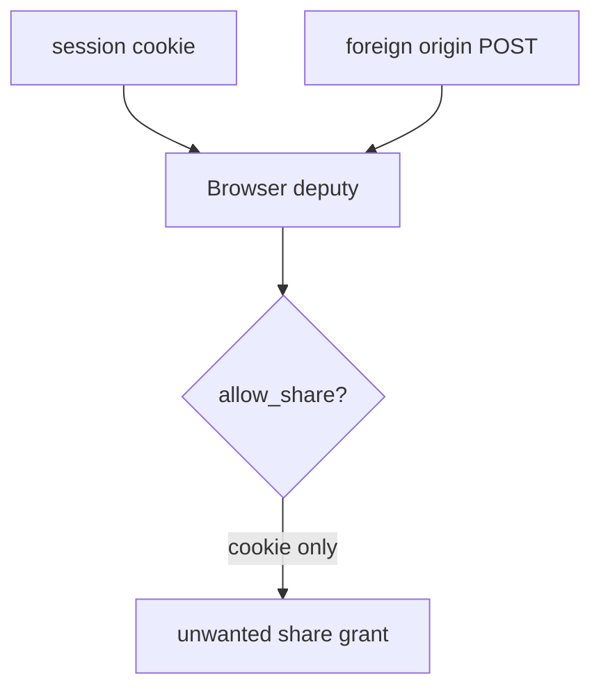
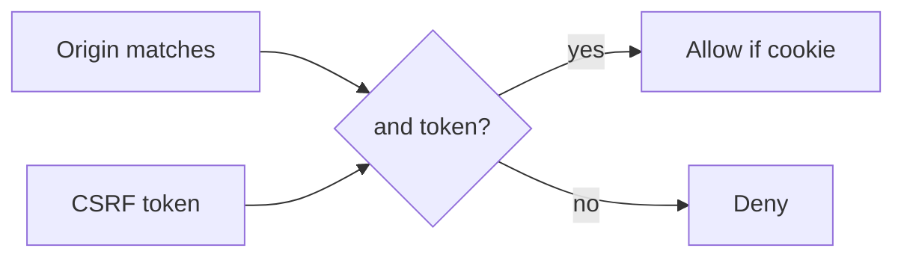

# 6.3-LO-01 — Ambient cookies are not consent to share

**Kind:** concept-model
**Loop step:** 1 Property
**Standards:** OWASP ASVS 5.0.0 (final) `v5.0.0-3.5.1`, `v5.0.0-3.5.3`, `v5.0.0-3.3.2`; `v5.0.0-3.5.8` is **Level 3, advanced**. SameSite and Fetch Metadata are *helpers*. Cookie session (2.3) is not this sentence.

## The claim this module owns

SecureCollab Phase 1 share is a **state-changing grant** (4.4). A browser will attach the session cookie to a request the user did not intend for this site. That cookie is ambient authority. It is not consent.

> `allow_share` from a foreign origin without a matching CSRF token must be false. Ambient cookies are not consent.

The forbidden outcome is **a cross-origin state-changing POST authorized by cookie alone**. That is a 1.1 integrity failure of share grants: an unwanted share against the browser as confused deputy.

ASVS `v5.0.0-3.5.1` wants anti-forgery tokens or extra non-CORS-safelisted headers when CORS preflight is not the defense. `v5.0.0-3.5.3` wants unsafe methods (not GET) or strict `Sec-Fetch-*`. `v5.0.0-3.3.2` wants SameSite set **according to purpose** — a helper, not complete. `v5.0.0-3.5.8` (authenticated embeds / CORP / Fetch Metadata) is **Level 3, advanced**.

## Mental model: cookie authority without site-bound intent



The attacker is an evil origin that can cause the victim’s browser to send the cookie. Trust is local `allow_share(origin, expected, token)`. Do not visit third-party sites.

**Mechanism (not the property):** SameSite=Lax, a CORS `*` reflex, or “JSON APIs can’t CSRF.”

## Mental model: origin × token × method



Bearer tokens in `Authorization` are a **different deputy**: they do not ride automatically on cross-site form POSTs. Cookie sessions do. GET that mutates share fails `v5.0.0-3.5.3`.

## Root cause vs impact vs prevention vs detection vs recovery

| Slice | For this property |
|---|---|
| Root cause | Cookie authority used without site-bound intent |
| Preconditions | `allow_share(evil, app, token=None)` is true |
| Trigger | Foreign-origin POST with ambient cookie |
| Impact | Integrity of share grants |
| Prevention | Reject foreign Origin; require token for cookie sessions |
| Detection | `foreign_origin_post_denied` |
| Recovery | Revoke surprise shares; notify |

## Framework defaults versus the CSRF guarantee

SameSite=Lax is not complete (top-level GET, browser exceptions, old clients). FastAPI does not add a CSRF token because you used cookies. CORS allowing `*` with credentials is a leak, not a CSRF defense.

## Mechanism limits

- Bearer APIs still need origin checks for cookie-backed fallbacks.
- Subdomain XSS, open redirect (6.5), and clickjacking/postMessage are named residuals.
- Lookalike UI that the user actually clicks is 4.2 phishing, not CSRF.

## Usability and accessibility

CSRF errors must be readable (not color-only). Do not make the secure path harder than a cross-site GET that still mutates. WCAG 2.2 applies to the deny page.

## Practice

Draw origin × token × method. Then run:

```
python3 -m pytest labs/6.3/6.3-lab/tests --impl vulnerable
python3 -m pytest labs/6.3/6.3-lab/tests --impl fixed
```

The first command must fail. The second must pass.

## Transfer

Clinic “share record with partner” POST. postMessage, clickjacking, CORS `*` with credentials.

## Non-goals

Live third-party CSRF, clickjacking trophies, dumping lab Python into notes. Gates 0–10 and milestones M0–M5 stay **not-attempted**. Answer keys are not in this file.
