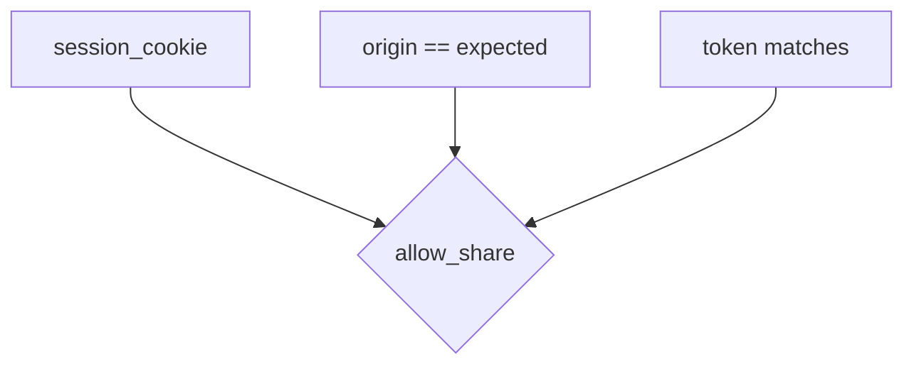
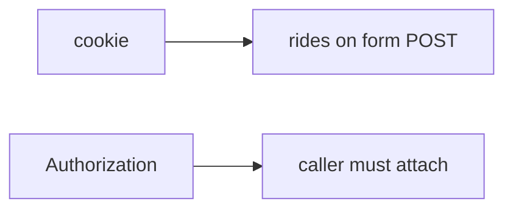

# 6.3-LO-02 — An origin × token map a second engineer can test

**Kind:** design-exercise
**Loop step:** 2 Model
**Standards:** OWASP ASVS 5.0.0 (final) `v5.0.0-3.5.1`.

## Can a second engineer name pytest cases from your origin map?

“SameSite is on” is not this lesson. A reviewable model names **who may POST share, with which cookie, origin, and token**.

SecureCollab Phase 1 freeze: local `allow_share(origin, expected, token, session_cookie)`. No live browsers.

## Mental model: three inputs, one decision

Missing cookie denies. Matching origin without token denies. Foreign origin denies.

## Mental model: Bearer is a different deputy

This lab is the cookie deputy. Do not treat a Bearer-only API as “CSRF solved” if a cookie fallback still exists.

## Step 1: freeze pieces

| Piece | This system |
|---|---|
| Subjects | victim browser; foreign origin |
| Objects | share grant |
| Actions | `allow_share` |
| Channels | cookie; Origin; CSRF token |
| TCB | origin match **and** token when cookie present |
| Untrusted | Origin header from the request; missing token |
| State / time | one POST |
| 1.1 cell | Integrity of share grants |

## Step 2: write cells

| Subject | Object | Action | Decision |
|---|---|---|---|
| same origin + token + cookie | share | POST | allow |
| foreign origin + cookie | share | POST | deny |
| same origin, no token | share | POST | deny |
| no cookie | share | POST | deny |
| GET | share | mutate | deny (named, not this fixture) |

## Practice

Fill the matrix. Point at `labs/6.3/6.3-lab` file `csrf.py`.

## Transfer

Clinic partner-share POST; postMessage origin check.

## Residual risk

Clickjacking; CORS credentials; `v5.0.0-3.5.8` Level 3 embeds; 4.2 lookalike UI.

## Non-goals

Top 10 as the definition of security. Keys stay out of lessons.
