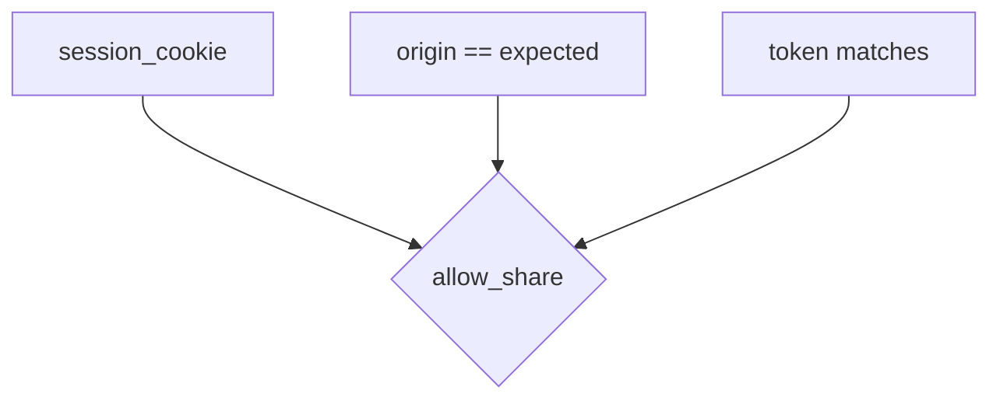
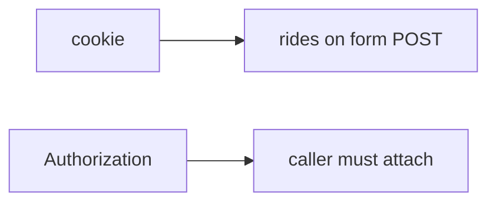

# An origin-and-token map someone else can test

**Kind:** design-exercise
**Loop step:** 2 Model

## Could someone else name the checks from your origin map?

“SameSite is on” is not this page. A map someone else can test names **who may POST share, with which cookie, origin, and token**.

This week’s freeze: local `allow_share(origin, expected, token, session_cookie)`. No live browsers.

## Picture: three inputs, one decision

Missing cookie denies. Matching origin without token denies. Foreign origin denies.

## Picture: a hand-attached token is a different helper

This lab is the leftover-cookie helper. Do not treat a Bearer-only API as “CSRF solved” if a cookie fallback still exists.

## Step 1: freeze pieces

| Piece | This system |
|---|---|
| People | victim browser; foreign origin |
| Objects | share grant |
| Actions | `allow_share` |
| Paths | cookie; Origin; CSRF token |
| What you trust | origin match **and** token when cookie present |
| What you do not trust | Origin header from the request; missing token |
| Time | one POST |
| The rule | Integrity of share grants |

## Step 2: write cells

| Subject | Object | Action | Decision |
|---|---|---|---|
| same origin + token + cookie | share | POST | allow |
| foreign origin + cookie | share | POST | deny |
| same origin, no token | share | POST | deny |
| no cookie | share | POST | deny |
| GET | share | mutate | deny (named, not this practice) |

## Practice

Open `csrf.py` in `labs/6.3/6.3-lab`.

## Use it somewhere new

Clinic partner-share POST; postMessage origin check.

## What can still go wrong

Clickjacking; CORS credentials; advanced authenticated embeds; lookalike UI from the phishing lesson.

## What this page is not doing

Do not treat a famous-bugs list as the definition of security. Answer keys are not on this site.
