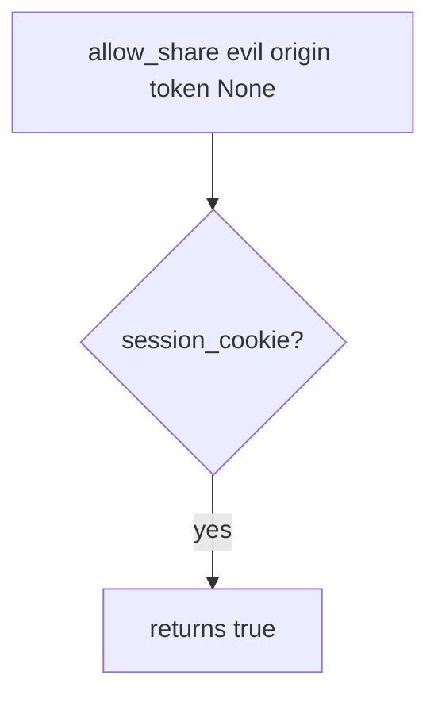

# Practice: a cross-site POST authorized by cookie alone

**Kind:** mechanism-lab
**Loop step:** 3 Break

## Try it

The practice is not a website you attack. `allow_share` treats a leftover session cookie as consent to share, even with no other site involved.

> Leftover cookies are not consent to share. If `allow_share` from a foreign origin with `token=None` is true, leftover cookie authority has replaced site-bound intent.

## Where you may practice

Stay inside `labs/6.3/6.3-lab`. Origins `https://evil.example` and `https://app.securecollab.test` are fake inputs to `allow_share`. It does not open a browser. Do not visit a lookalike page, an employer share endpoint, or a classmate preview as this exercise.

What must not happen: a cross-site POST that changes a share, authorized by cookie alone. `allow_share("https://evil.example", expected, token=None)` returns true.

Picture a foreign origin that can cause the victim browser to POST while the session cookie is leftover — a clinic “share with partner” button the person did not click on this site. `allow_share` is supposed to require cookie **and** origin match **and** a matching CSRF token — not SameSite=Lax, CORS, or “the user is logged in”.

## Picture: leftover cookie is enough in the broken files



A leftover cookie is treated as consent — not an attack on a public app. `allow_share` returns `session_cookie` and ignores origin and token. You do not need a live third-party page. You must not build one.

SameSite set for purpose is a helper, not complete. Anti-forgery tokens (or extra headers a simple form cannot set). This practice covers `allow_share`.

## What to look at: the cause, not a hunt

`vulnerable/csrf.py` returns `session_cookie` and ignores origin and token. Tests:

- `test_foreign_origin_post_is_denied`
- `test_same_origin_without_token_is_denied`
- `test_same_origin_with_token_is_allowed` — honest path; may pass on the broken files because a cookie is present
- `test_missing_cookie_is_denied` — may pass on both

## Why it happens vs what it costs

| Slice | Practice |
|---|---|
| Required rule | Foreign origin without token cannot share |
| Why it happens | Cookie authority used without site-bound intent |
| What's already wrong | `allow_share` returns true whenever `session_cookie` is true |
| Trigger | `allow_share` with foreign origin and `token=None` |
| What it costs | Integrity of share grants; unwanted collaborator |
| How you stop it later | Cookie and origin == expected and matching token; fail closed |
| How you notice later | `foreign_origin_post_denied` by expected host; never the cookie |
| How you recover later | Keep deny; revoke grants created in the window |
| Out of scope | SameSite as the definition, CORS, or a live third-party page |

FastAPI `Request.cookies` will attach whatever the browser sent. Starlette CORS middleware is not CSRF. Next.js server actions still need origin and token at the grant. Foreign origin + no token is False.

## Practice

```text
python3 -m pytest labs/6.3/6.3-lab/tests --impl vulnerable
```

Do not visit `evil.example` as a real host. A setup error is not proof the rule holds.

## Use it somewhere new

Clinic partner-share. Predict without leaving this directory. Do not hit a live clinic system.

## What this page is not doing

No live-target CSRF walkthroughs. Fake origins only. Do not “fix” the practice by deleting the test.
