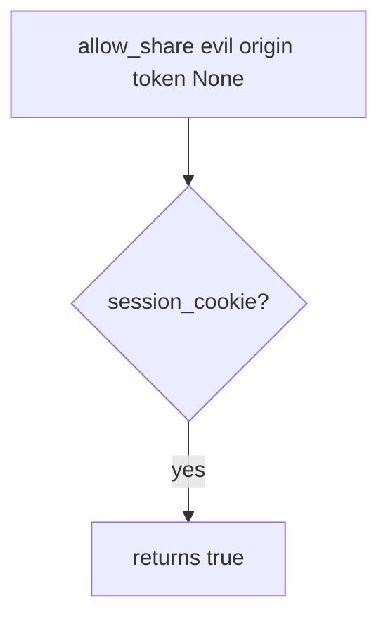

# 6.3-LO-03 — Observe cookie-only share, do not trophy a third-party site

**Kind:** mechanism-lab
**Loop step:** 3 Break
**Standards:** OWASP ASVS 5.0.0 (final) `v5.0.0-3.5.1`.

## Authorized scope

`labs/6.3/6.3-lab` only. Synthetic origins. No live third-party pages.

**Forbidden outcome:** Cross-origin state-changing POST authorized by cookie alone.

## Mental model: cookie is enough in the vulnerable tree



The vulnerable tree demonstrates **cause** (ambient cookie treated as consent), not a cross-site trophy against a public app.

## What to read in the fixture

`vulnerable/csrf.py` returns `session_cookie` and ignores origin and token. Tests require foreign origin without token to be false. Honest same-origin-with-token must be true on the fixed tree; it may already be true on vulnerable because a cookie is present.

## Root cause vs impact

| Slice | Lab |
|---|---|
| Root cause | Cookie authority used without site-bound intent |
| Impact | Unwanted share grant |
| Not the lesson | SameSite as the definition |

## Practice

```
python3 -m pytest labs/6.3/6.3-lab/tests --impl vulnerable
```

Record `test_foreign_origin_post_is_denied`. Do not visit `evil.example` as a real host.

## Transfer

Clinic partner-share. Predict without leaving this directory.

## Non-goals

No live-target instructions. Synthetic data only.
