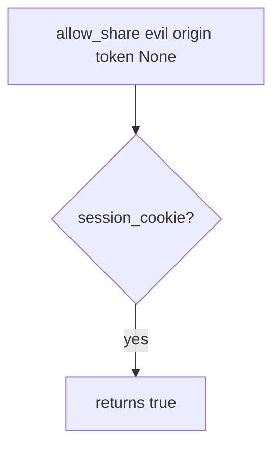

# 6.3-LO-03 — Observe cookie-only share, do not trophy a third-party site

**Kind:** mechanism-lab
**Loop step:** 3 Break
**Standards:** OWASP ASVS 5.0.0 (final) `v5.0.0-3.5.1`. `v5.0.0-3.5.8` is **Level 3, advanced**. SameSite is a helper, not this oracle.

## Authorized scope

`labs/6.3/6.3-lab` only. The fixture is an in-process `allow_share`. Synthetic origins `https://evil.example` and `https://app.securecollab.test`. It does not open a browser. Do not visit a lookalike page, an employer share endpoint, or a classmate preview as this exercise.

**Forbidden outcome:** cross-origin state-changing POST authorized by cookie alone. `allow_share("https://evil.example", expected, token=None)` returns true.

Attacker capability in this lab: a foreign origin that can cause the victim browser to POST while the session cookie is ambient. That stands in for a clinic “share with partner” button the user did not click on this site. Trust assumption: `allow_share` is supposed to require cookie **and** origin match **and** a matching token. SameSite=Lax, CORS, and “the user is logged in” are not in the TCB for this cell.

## Mental model: cookie is enough in the vulnerable tree



The vulnerable tree demonstrates **cause** (ambient cookie treated as consent), not a cross-site trophy against a public app. Preconditions: `allow_share` returns `session_cookie` and ignores origin and token. You do not need a live third-party page. You must not build one.

ASVS `v5.0.0-3.5.1` wants anti-forgery tokens (or extra non-CORS-safelisted headers). SameSite (`v5.0.0-3.3.2`) is set according to purpose — a helper, not complete.

## What to read in the fixture

`vulnerable/csrf.py` returns `session_cookie` and ignores origin and token. Tests:

- `test_foreign_origin_post_is_denied`
- `test_same_origin_without_token_is_denied`
- `test_same_origin_with_token_is_allowed` — honest path; may pass on vulnerable because a cookie is present
- `test_missing_cookie_is_denied` — may pass on both

You do not need a new origin string. The failure of `test_foreign_origin_post_is_denied` *is* the evidence.

Do not open the fixed tree yet. Diagnose the cause first.

## Root cause vs impact vs prevention vs detection vs recovery

| Slice | This lab |
|---|---|
| Required property | Foreign origin without token cannot share |
| Root cause | Cookie authority used without site-bound intent |
| Preconditions | `allow_share` returns true whenever `session_cookie` is true |
| Trigger | `allow_share` with foreign origin and `token=None` |
| Impact | Integrity of share grants (4.4); unwanted collaborator |
| Prevention | Cookie ∧ origin == expected ∧ matching token; fail closed |
| Detection | `foreign_origin_post_denied` by expected host; never the cookie |
| Recovery | Keep deny; revoke grants created in the window |
| Not the lesson | SameSite as the definition, CORS, or a live third-party page |

## Framework defaults versus the intent guarantee

FastAPI `Request.cookies` will attach whatever the browser sent. Starlette CORSMiddleware is not CSRF. Next.js server actions still need origin/token at the grant. The application guarantee is: **this** fixture, foreign origin + no token is False.

## Practice

```text
python3 -m pytest labs/6.3/6.3-lab/tests --impl vulnerable
```

Record `test_foreign_origin_post_is_denied`. Do not visit `evil.example` as a real host. An environment error is not security evidence.

## Transfer

Clinic partner-share. Predict without leaving this directory. Do not hit a live EHR.

## Non-goals

No live-target instructions. Synthetic origins only.
