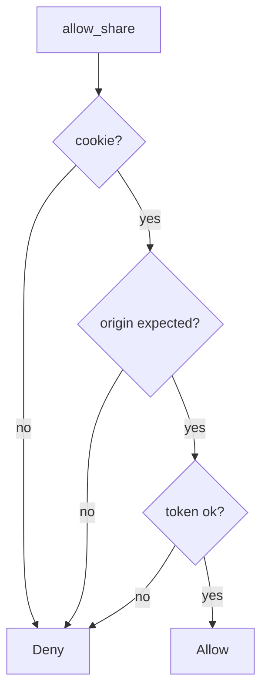

# 6.3-LO-04 — Require origin match and CSRF token

**Kind:** design-exercise
**Loop step:** 4 Build
**Standards:** OWASP ASVS 5.0.0 (final) `v5.0.0-3.5.1`. `v5.0.0-3.5.3` wants unsafe methods. `v5.0.0-3.5.8` is **Level 3, advanced**. SameSite (`v5.0.0-3.3.2`) is a helper.

## Structural means the cookie is not enough

`allow_share` must require a session cookie **and** `origin == expected` **and** a matching token. Structural means site-bound intent — not SameSite as the only check, not CORS as a stand-in, not “the user clicked something somewhere.”

The smallest restore for SecureCollab Phase 1 share is: all three, or deny. Fail-safe: missing origin or token **denies**. Do not fail open because SameSite is Lax.

## Mental model: all three, or deny



The lab’s fixed tree is `session_cookie` then `origin == expected and token == "lab-csrf"`. Production still needs the token bound to the session (not a cookie the foreign origin can cause to be sent). GET `/share?to=` is a mutate-on-GET residual. Clickjacking, postMessage, and open redirect (6.5) stay named residuals. CORS `*` with credentials is false assurance.

ASVS `v5.0.0-3.5.1` wants anti-forgery tokens or extra non-CORS-safelisted headers. This pytest is that sentence for `allow_share`.

## Why this restores the cell

| After the fix | Must be true |
|---|---|
| foreign origin, no token | false |
| same origin, matching token, cookie | true |
| cookie missing | false |
| same origin, no token | false |

## What this is not

SameSite=Lax as complete. CORS `*` with credentials. Token stored in a cookie that the foreign origin can cause to be sent (double-submit without binding). GET `/share?to=`. Fetch Metadata as the only check.

## Mechanism limits

- Clickjacking / `frame-ancestors` (`v5.0.0-3.4.6`) is a different cell.
- postMessage origin checks (`v5.0.0-3.5.5`) are a different cell.
- Open redirect (6.5) can still send the user somewhere else after a real click.
- Authenticated embeds / CORP (`v5.0.0-3.5.8`) are Level 3 advanced.
- 4.2 phishing: the user intended the *lookalike*, not this origin.

## Practice

Name the predicate (cookie ∧ origin == expected ∧ token). Run:

```text
python3 -m pytest labs/6.3/6.3-lab/tests --impl fixed
```

Must pass.

## Transfer

Clinic: stop treating “logged-in cookie” as consent to share with a partner.

## Residual risk

Clickjacking; postMessage; open redirect (6.5); Level 3 embeds; 4.2 phishing; GET mutate.

## Non-goals

Do not visit a live foreign origin. Do not claim Gate 6 from SameSite=Lax.
