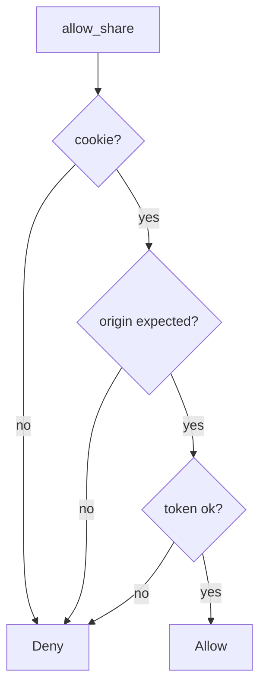

# 6.3-LO-04 — Require origin match and CSRF token

**Kind:** design-exercise
**Loop step:** 4 Build
**Standards:** OWASP ASVS 5.0.0 (final) `v5.0.0-3.5.1`.

## Structural means the cookie is not enough

`allow_share` must require a session cookie **and** `origin == expected` **and** a matching token. Structural means site-bound intent — not SameSite as the only check, not CORS as a stand-in.

## Mental model: all three, or deny



Fail-safe: missing origin or token **denies**.

## Why this restores the cell

| After the fix | Must be true |
|---|---|
| foreign origin, no token | false |
| same origin, matching token, cookie | true |
| cookie missing | false |
| same origin, no token | false |

## What this is not

SameSite=Lax as complete. CORS `*` with credentials. Token stored in a cookie that the foreign origin can cause to be sent (double-submit without binding). GET `/share?to=`.

## Practice

Name the predicate. Run:

```
python3 -m pytest labs/6.3/6.3-lab/tests --impl fixed
```

Must pass.

## Transfer

Clinic: stop treating “logged-in cookie” as consent to share with a partner.

## Residual risk

Clickjacking; postMessage; open redirect (6.5); `v5.0.0-3.5.8` Level 3; 4.2 phishing.
