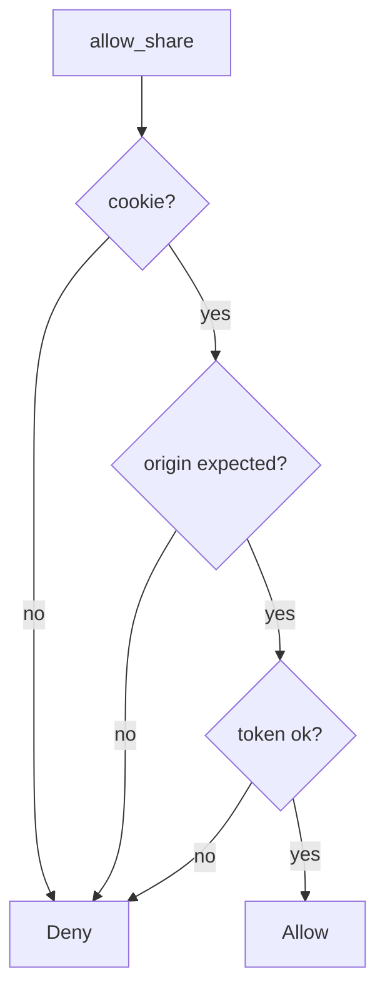

# Require origin match and a CSRF token

**Kind:** design-exercise
**Loop step:** 4 Build

## The rule

A leftover cookie does not decide a cross-site share. SameSite as the only check still allows a foreign origin with `token=None`. CORS is an origin header, not the share. “The user clicked something somewhere” is a story.

The structural change is: `allow_share` must require a session cookie **and** `origin == expected` **and** a matching CSRF token. Structural means site-bound intent — not leftover cookie authority from the surroundings.

The smallest fix for share is: all three, or deny. Fail closed: missing origin or token **denies**. Do not fail open because SameSite is Lax.

## Picture: all three, or deny



The lab’s repaired files are `session_cookie` then `origin == expected and token == "lab-csrf"`. Production still needs the token bound to the session (not a cookie the foreign origin can cause to be sent). GET `/share?to=` is a mutate-on-GET leftover. Clickjacking, postMessage, and a later open-redirect lesson stay named leftovers. CORS `*` with credentials is false assurance.

Use anti-forgery tokens or extra headers a simple form cannot set — `allow_share`. Extra rows about authenticated embeds and CORP are **advanced** — not this check.

## What the repaired files must show

| After the fix | Must be true |
|---|---|
| foreign origin, no token | false |
| same origin, matching token, cookie | true |
| cookie missing | false |
| same origin, no token | false |

## What this is not

SameSite=Lax as complete. CORS `*` with credentials. Token stored in a cookie that the foreign origin can cause to be sent (double-submit without binding). GET `/share?to=`. Fetch metadata as the only check.

## What the tool cannot do

- Clickjacking / who may frame the page is a different rule.
- postMessage origin checks are a different rule.
- A later open-redirect lesson can still send the person somewhere else after a real click.
- Authenticated embeds / CORP are advanced extras.
- Lookalike UI from the phishing lesson: the person intended the *lookalike*, not this origin.

## Practice

Name the check (cookie and origin == expected and token). Run:

```text
python3 -m pytest labs/6.3/6.3-lab/tests --impl fixed
```

## Use it somewhere new

Stop treating “logged-in cookie” as consent to share with a partner.

## What can still go wrong

Clickjacking; postMessage; later open redirect; advanced embeds; lookalike UI; GET that still mutates.

## What this page is not doing

Do not visit a live foreign origin. Do not claim a course gate from SameSite=Lax.
