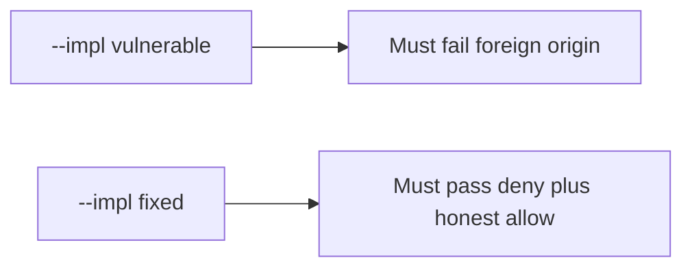

# 6.3-LO-05 — Evidence is foreign-origin deny, then a passing pair

**Kind:** verification-lab
**Loop step:** 5 Verify
**Standards:** OWASP ASVS 5.0.0 (final) `v5.0.0-3.5.1`.

## An invariant that cannot fail a test is still a slogan

“SameSite is Lax” is not evidence. The oracle is the local pair.

## Mental model: fail-on-vulnerable, pass-on-fixed



| Case | Must show |
|---|---|
| Negative / abuse | foreign origin, no token → deny |
| Negative | same origin, no token → deny |
| Normal | same origin, token, cookie → allow |
| Normal / fail-closed | missing cookie → deny |
| Not claimed | GET mutate; clickjacking; CORS; postMessage |

```
python3 -m pytest labs/6.3/6.3-lab/tests --impl vulnerable
python3 -m pytest labs/6.3/6.3-lab/tests --impl fixed
```

Honest same-origin-with-token may pass on both (vulnerable allows any cookie). Missing cookie may pass on both.

## What the tests do not prove

- SameSite cookie flags (`v5.0.0-3.3.2`)
- Fetch Metadata / CORP Level 3 (`v5.0.0-3.5.8`)
- Clickjacking / `frame-ancestors` (`v5.0.0-3.4.6`)
- postMessage origin checks (`v5.0.0-3.5.5`)

## Practice

Execute both implementations. Map each test to an LO-02 cell.

## Transfer

Clinic partner-share. A test that only asserts HTTP 200 on `/share` is not this cell.
