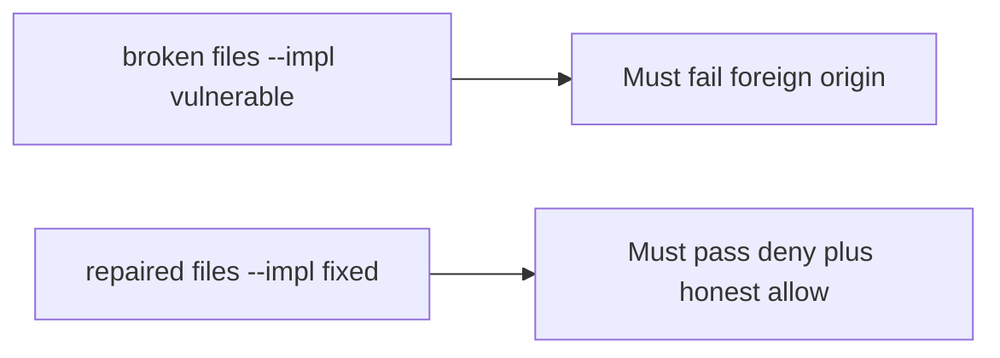

# The broken files must fail a request from another site

**Kind:** verification-lab
**Loop step:** 5 Verify

## Check it

“SameSite is Lax” is not evidence. “CORS is configured” is a tool observation. The check is: `allow_share` for a foreign origin with `token=None` is False. That observation must be **false** on the broken files (returns true) and **true** on the repaired files.

## Picture: broken must fail foreign origin

A passing-test tally can still hide that leftover cookies still authorize a share. Repaired files still have to pass both the deny and the honest allow.



| Mode | Must show for this topic |
|---|---|
| Wrong input / abuse | foreign origin, no token → deny; broken files must fail |
| Wrong input | same origin, no token → deny |
| Normal | same origin, token, cookie → allow |
| Normal / fail-closed | missing cookie → deny (may pass on both) |
| Not claimed | GET mutate; clickjacking; CORS; postMessage |

`test_foreign_origin_post_is_denied` is there so a cookie-only share still fails.

```text
python3 -m pytest labs/6.3/6.3-lab/tests --impl vulnerable
python3 -m pytest labs/6.3/6.3-lab/tests --impl fixed
```

Honest same-origin-with-token may pass on both (broken files allow any cookie). Missing cookie may pass on both. That does not excuse the foreign-origin and same-origin-without-token tests. If the broken files do not fail foreign origin, the lab is miswired — fix the wiring, not the assertion. A setup error is not proof the rule holds.

## What the tests do not prove

- SameSite cookie flags
- Fetch metadata / CORP (advanced)
- Clickjacking / who may frame the page
- postMessage origin checks
- Later open redirect

## Practice

```text
python3 -m pytest labs/6.3/6.3-lab/tests --impl vulnerable
python3 -m pytest labs/6.3/6.3-lab/tests --impl fixed
```

Do not treat a grep for `SameSite` in a cookie helper as the check. Call `allow_share` on a foreign origin.

## Use it somewhere new

Clinic partner-share. Asserting HTTP 200 on `/share` is not this check (see the later testing topic). Do not run a test that visits a live third-party page.

## What this page is not doing

Do not add a live CSRF page. Do not log cookie values. Answer keys are not on this site.
