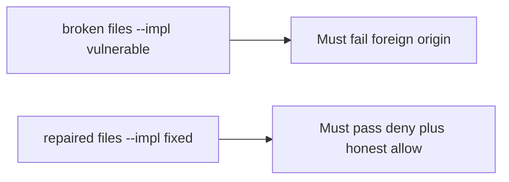

# The broken files must fail a request from another site

**Kind:** verification-lab
**Loop step:** 5 Verify

## Check it

SameSite=Lax does not decide a cross-site share. A CORS list is an origin header. `allow_share` for a foreign origin with `token=None` has to be False. Leftover: a foreign origin with no token still shares. Repair returns false.

## Picture: broken must fail foreign origin

Leftover cookies can still authorize a share while tests pass. Repaired files still have to pass both the deny and the honest allow.



| Mode | Must show for this topic |
|---|---|
| Wrong input / abuse | foreign origin, no token → deny; broken files must fail |
| Wrong input | same origin, no token → deny |
| Normal | same origin, token, cookie → allow |
| Normal / deny when missing | missing cookie → deny (may pass on both) |
| Not claimed | GET mutate; clickjacking; CORS; postMessage |

Foreign-origin POST with no token has to fail `test_foreign_origin_post_is_denied`.

```text
python3 -m pytest labs/6.3/6.3-lab/tests --impl vulnerable
python3 -m pytest labs/6.3/6.3-lab/tests --impl fixed
```

Same-origin with a token is the honest path. Deny a foreign origin, and same-origin with no token. If the broken files do not fail foreign origin, the lab is miswired — fix the wiring, not the assertion. A setup error is not proof the rule holds.

## What the tests do not prove

- SameSite cookie flags
- Fetch metadata / CORP (advanced)
- Clickjacking / who may frame the page
- postMessage origin checks
- Later open redirect

## Practice

Call `allow_share` on a foreign origin. `SameSite` on a cookie helper is the cookie flag, not the share.

## Use it somewhere new

A green `/share` is not a foreign-origin deny. Do not run a test that visits a live third-party page.

## What this page is not doing

Do not add a live CSRF page. Do not log cookie values. Answer keys are not on this site.
