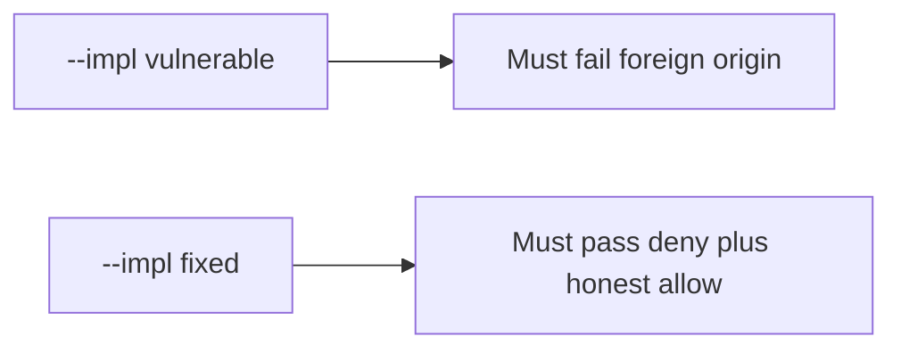

# 6.3-LO-05 — Evidence is foreign-origin deny, then a passing pair

**Kind:** verification-lab
**Loop step:** 5 Verify
**Standards:** OWASP ASVS 5.0.0 (final) `v5.0.0-3.5.1`.

## An invariant that cannot fail a test is still a slogan

“SameSite is Lax” is not evidence. “CORS is configured” is a mechanism observation. The oracle is: `allow_share` for a foreign origin with `token=None` is False. That observation must be **false** on `--impl vulnerable` (returns true) and **true** on `--impl fixed`.

## Mental model: vulnerable must fail: foreign origin

The failing observation on `--impl vulnerable` is **foreign origin**. A passing collection count is not this cell.



| Mode | Must show for this module |
|---|---|
| Negative / abuse | foreign origin, no token → deny; vulnerable must fail |
| Negative | same origin, no token → deny |
| Normal | same origin, token, cookie → allow |
| Normal / fail-closed | missing cookie → deny (may pass on both) |
| Not claimed | GET mutate; clickjacking; CORS; postMessage |

Lab tests in `labs/6.3/6.3-lab/tests/test_property.py`. `test_foreign_origin_post_is_denied` is a **forbidden-outcome** test: a cookie-only share is not allowed to count as a passing control.

```text
python3 -m pytest labs/6.3/6.3-lab/tests --impl vulnerable
python3 -m pytest labs/6.3/6.3-lab/tests --impl fixed
```

Honest same-origin-with-token may pass on both (vulnerable allows any cookie). Missing cookie may pass on both. That does not excuse the foreign-origin and same-origin-without-token tests. If vulnerable does not fail foreign origin, the lab is miswired—fix the wiring, not the assertion.

## What the tests do not prove

- SameSite cookie flags (`v5.0.0-3.3.2`)
- Fetch Metadata / CORP Level 3 (`v5.0.0-3.5.8`)
- Clickjacking / `frame-ancestors` (`v5.0.0-3.4.6`)
- postMessage origin checks (`v5.0.0-3.5.5`)
- Open redirect (6.5)

Record those as residuals or later modules, not as silent passes.

## Practice

Execute both implementations this session. Write the fail/pass pair next to the matrix row. Reject a “test” that only greps `SameSite` in a cookie helper without calling `allow_share` on a foreign origin.

## Transfer

Clinic partner-share. A test that only asserts HTTP 200 on `/share` is not this cell (see 9.3). A test that visits a live third-party page is out of scope.

## Non-goals

Do not add a live CSRF page. Do not log cookie values. Keys stay out of this file.
