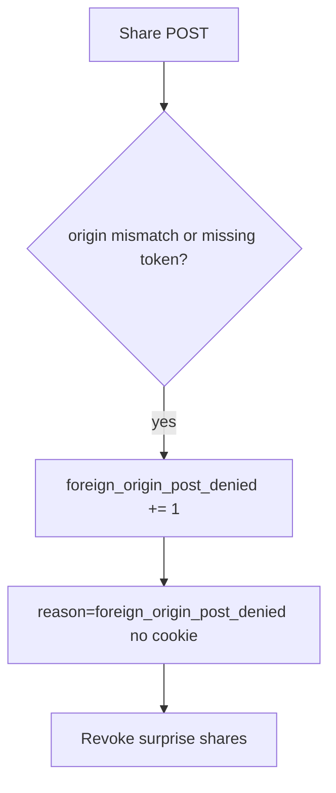

# 6.3-LO-06 — Detect foreign_origin_post_denied; revoke surprise shares

**Kind:** operations-exercise
**Loop step:** 6 Operate
**Standards:** NIST CSF 2.0 (final) DE/RS/RC as outcome labels; OWASP ASVS 5.0.0 (final) `v5.0.0-3.5.1`.

## Prevention is not absolute

A new JSON share route can forget the token check. Pair detect and recover. Do not log cookie values (4.3) or note bodies (3.1).

## Mental model: denied foreign POST is a signal



| Outcome | This module |
|---|---|
| Detect | `foreign_origin_post_denied` |
| Signal | request id, expected origin host; never the cookie or token |
| Recover | Keep deny; revoke grants created in the window; notify the member |
| Residual | Lookalike UI the user clicked (4.2); clickjacking |

## Practice

Write one log line you would accept. Tie it to `labs/6.3/6.3-lab`.

```
log_denied reason=foreign_origin_post_denied expected_host=app.securecollab.test request_id=req_63c
```

Reject any line that includes a session cookie, CSRF token, or note body.

## Transfer

Clinic: detect partner-share POSTs from the wrong origin; do not paste cookies into the ticket.

## Non-goals

A WAF product name is not the property.
