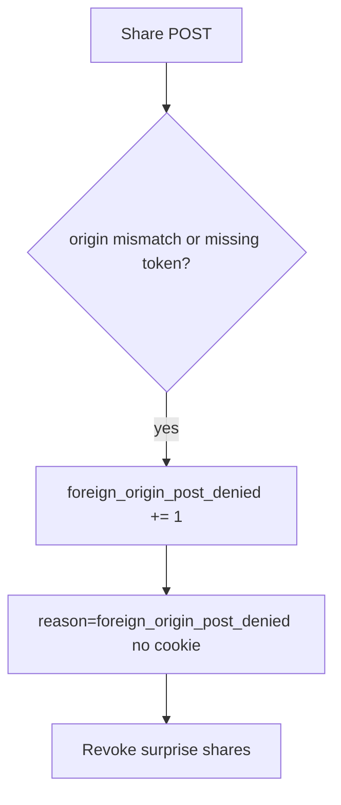

# Notice a foreign-origin POST; revoke surprise shares

**Kind:** operations-exercise
**Loop step:** 6 Operate

## Fixing it once is not enough

A new JSON share route can forget the token check after `allow_share` was “fixed once.” Do not log cookie values or note bodies. Do not paste cookies into the ticket.

## Picture: a denied foreign POST is a signal



| Outcome | This topic |
|---|---|
| Notice | `foreign_origin_post_denied` |
| What the line holds | request id, expected origin host; never the cookie or token |
| Recover | Keep deny; revoke grants created in the window; notify the member |
| Leftover | Lookalike UI the person clicked (phishing lesson); clickjacking |

A network-filter product name does not bind origin and token or prove the anti-forgery check. Re-run `test_foreign_origin_post_is_denied` after any share-route change; a green “SameSite=Lax” tile is not that check. JSON share routes and GET mutate paths are other paths of the same rule — inventory them before you claim recover.

## What the framework does vs what you still have to check

A network filter will page on cross-site POST volume and stay silent when `/share.json` still keys only the cookie. Notice must observe **origin mismatch or missing token at `allow_share`**, not CORS error counts. If the alert includes a session cookie or CSRF token, you have opened a logging hole from an earlier topic.

## Can people still use it

If a human sees “share blocked,” announce it in text a screen reader can speak. A silent no-op pushes people to retry from a lookalike (phishing lesson).

## Practice

For `labs/6.3/6.3-lab`, write a log line you would accept.

```text
log_denied reason=foreign_origin_post_denied expected_host=app.securecollab.test request_id=req_63c
```

Reject any line that includes a session cookie, CSRF token, or note body.

## Use it somewhere new

A clinic example: notice partner-share POSTs from the wrong origin; do not paste cookies into the ticket. Do not visit a live foreign origin.

## What this page is not doing

Naming a network-filter product is not the rule. Live third-party CSRF is out of scope. This site does not mark you as finished. Answer keys are not on this site.
