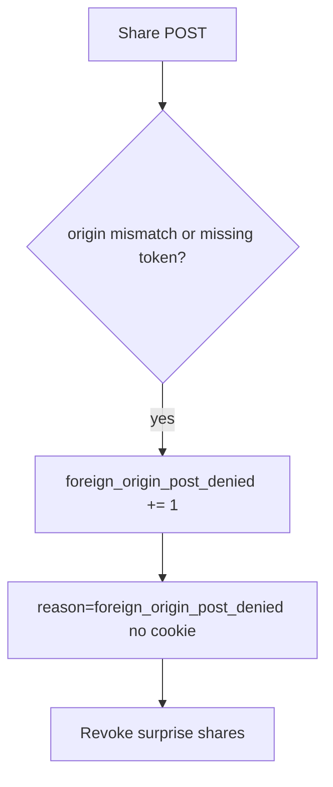

# 6.3-LO-06 — Detect foreign_origin_post_denied; revoke surprise shares

**Kind:** operations-exercise
**Loop step:** 6 Operate
**Standards:** NIST CSF 2.0 (final) DE/RS/RC as outcome labels; OWASP ASVS 5.0.0 (final) `v5.0.0-3.5.1`. CSF names outcomes; it does not bind origin and token.

## Prevention is not absolute

A new JSON share route can forget the token check after `allow_share` was “fixed once.” Pair detect and recover. Do not log cookie values (4.3) or note bodies (3.1). Do not paste cookies into the ticket.

## Mental model: denied foreign POST is a signal



| Outcome | This module |
|---|---|
| Detect | `foreign_origin_post_denied` |
| Signal | request id, expected origin host; never the cookie or token |
| Recover | Keep deny; revoke grants created in the window; notify the member |
| Residual | Lookalike UI the user clicked (4.2); clickjacking |

CSF 2.0 Detect / Respond / Recover name outcomes. They do not prove `v5.0.0-3.5.1`. A WAF product name is not the property. Re-run `test_foreign_origin_post_is_denied` after any share-route change; a green “SameSite=Lax” tile is not that pytest. JSON share routes and GET mutate paths are other paths of the same cell — inventory them before claiming Recover.

## Framework defaults versus the operate guarantee

A WAF will page on cross-site POST volume and stay silent when `/share.json` still keys only the cookie. Detection must observe **origin mismatch or missing token at `allow_share`**, not CORS error counts. If the alert includes a session cookie or CSRF token, you have opened a 4.3 cell.

## Practice

Write one log line you would accept. Tie it to `labs/6.3/6.3-lab`.

```text
log_denied reason=foreign_origin_post_denied expected_host=app.securecollab.test request_id=req_63c
```

Reject any line that includes a session cookie, CSRF token, or note body.

## Transfer

Clinic: detect partner-share POSTs from the wrong origin; do not paste cookies into the ticket. Do not visit a live foreign origin.

## Usability

If a human sees “share blocked,” announce it (WCAG 2.2 Success Criterion 4.1.3). A silent no-op pushes people to retry from a lookalike (4.2).

## Non-goals

A WAF product name is not the property. Live third-party CSRF is out of scope. Gates 0–10 stay not-attempted.
