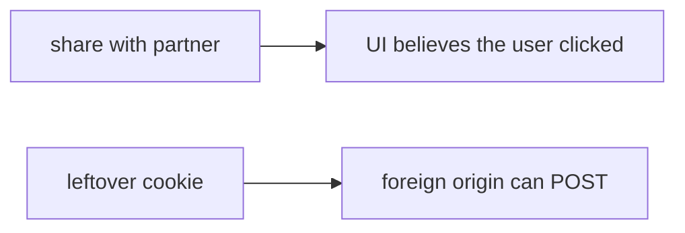

# Same idea on a clinic share-with-partner POST

**Kind:** transfer-challenge
**Loop step:** 7 Transfer

## Use it somewhere new

You get a **clinic sketch** with a “share record with partner” POST that relies on the login cookie.

`allow_share` from a foreign origin without a matching CSRF token is false. For a clinic, leftover cookies are not consent to share.

Clinic “share record with partner” POST. Also name postMessage, clickjacking, and CORS `*` with credentials as leftovers — do not run them against a live clinic.

## Picture: partner share is still a grant POST

If the partner-share POST keys only the login cookie, the rule is gone. FastAPI, SameSite=Lax, and a CORS allow-list do not bind origin and token. CORS `*` with credentials is false assurance. postMessage and clickjacking are named leftovers: they can still confuse the helper after this check is green.

A foreign origin without a token still has to be false, and same origin without a token still has to be false. Setting SameSite=Lax without an origin-and-token test leaves leftover cookies as consent. The local check is `test_foreign_origin_post_is_denied` plus `test_same_origin_without_token_is_denied` — on a practice, not a live clinic system.

## Write this for a clinic sketch

1. who can act (foreign origin using the victim browser as helper — **not** a live clinic);
2. what you trust (origin + token are trusted; SameSite is not);
3. what must not happen (`allow_share` true for foreign origin without token);
4. a test idea on **local** practice files only (foreign origin + no token is false);
5. leftover (GET mutate; clickjacking; postMessage; CORS credentials; advanced embeds; lookalike UI from the phishing lesson);
6. whether a human-seen “share blocked” path must be announced in text, not a silent no-op that pushes people to retry from a lookalike.

## What is not good enough

| Reject | Why |
|---|---|
| “SameSite is Lax” | Helper, not complete |
| Live clinic probe | Course rules |
| CORS as the CSRF rule | A different rule |
| HTTP 200 as intent evidence | Wrong observation |
| Cookie-only “logged in” as consent | This rule's failure |

## Practice

One page. No answer keys. `labs/6.3/6.3-lab` is the only running system you may break. Do not visit a live foreign origin.

## What this page is not doing

Do not try live-target CSRF. Do not use real session cookies. This page does not finish a check-in.
