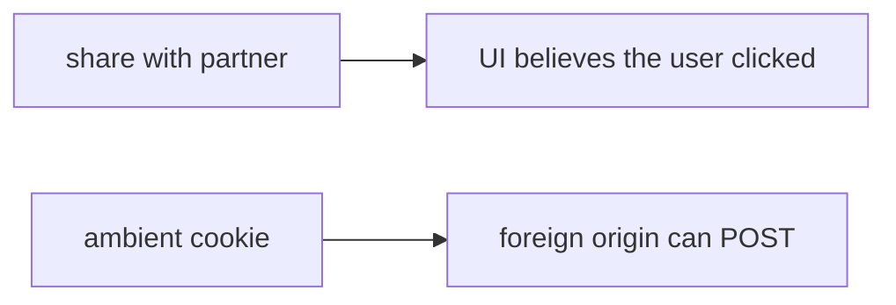

# 6.3-LO-07 — Transfer: clinic share-with-partner POST

**Kind:** transfer-challenge
**Loop step:** 7 Transfer
**Standards:** OWASP ASVS 5.0.0 (final) `v5.0.0-3.5.1`. SameSite is a helper.

## Change the workplace; keep cookie-without-intent

Do not answer with a Top 10 / CWE / scanner as the definition of security.

**Prompt:** Clinic “share record with partner” POST. Also name postMessage, clickjacking, and CORS `*` with credentials as residuals — do not run them against a live clinic.

**Product sketch:** EHR-lite share button that relies on the login cookie.

Rewrite the SecureCollab sentence. Include:

1. attacker capabilities (foreign origin using the victim browser as deputy — not a live clinic);
2. trust assumptions (origin + token are TCB; SameSite is not);
3. forbidden outcome (`allow_share` true for foreign origin without token, not “HIPAA”);
4. a test idea on a **local** fixture only;
5. residual (GET mutate; clickjacking; postMessage; CORS credentials; Level 3 embeds; 4.2 phishing);
6. WCAG if a human deny page is in the claim (readable “share blocked,” not a silent no-op).

## Mental model: partner share is still a grant POST

## What graders reject

| Reject | Why |
|---|---|
| “SameSite is Lax” | Helper, not complete |
| Live clinic probe | Lab policy |
| CORS as the CSRF property | Different cell |

## Practice

One page. No keys. `labs/6.3/6.3-lab` is the only running system you may break.
