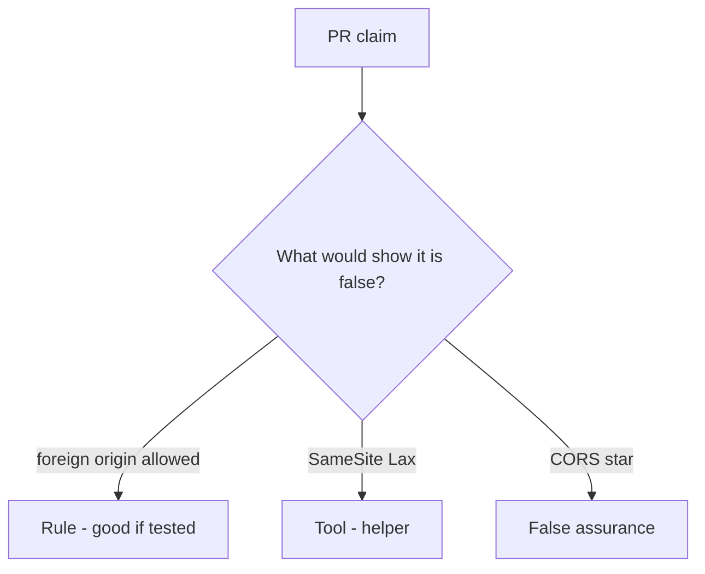

# Review of a cookie-only share POST

**Kind:** code-review
**Loop step:** Review

The answers are not on this page. Do not open the keys file until someone has looked at your review.

## What you are reviewing

A colleague ships notes-app share. Check whether `allow_share` for a foreign origin with `token=None` is still true, compare that with the module rule, and write changes a developer can verify.

The folder `labs/6.3/6.3-lab/vulnerable/` is the change. The check you already ran (`test_foreign_origin_post_is_denied`) is the rule test. A comment “will add CSRF later” is not.

## Picture: leftover cookie auth + no Origin check

**Cookie auth + no Origin check**. Label it rule, tool, or false assurance before you accept the change.

What has to stay true: foreign origin without token denied. If that call never includes origin-and-token, that leftover-cookie path is still open. SameSite=Lax without that test is still the same problem.

Leftover cookies are leftover permission from login — a signed-in session cookie that rides along — used as if it were consent for this person, this share, and this origin.

## Problems to find (name them yourself)

- Cookie auth + no Origin check
- GET `/share?to=`
- CORS `*` with credentials
- Token in a cookie not bound to the session

Also reject: live third-party CSRF; closing findings without re-running `test_foreign_origin_post_is_denied`; keys in lessons.

## Common mix-ups

- SameSite is CSRF done
- JSON APIs cannot CSRF
- CORS is CSRF defense
- Logged-in cookie is consent
- Fetch metadata alone is this check

## Practice

Write three review notes a maintainer could act on. Each note: what you saw, rule or false assurance, suggested structural change, leftover you will **not** delete. Tie at least one to `test_foreign_origin_post_is_denied`. Do not open the keys file.

## Use it somewhere new

Clinic change that “set SameSite=Lax” without an origin-and-token test is an incomplete review of leftover cookies. Name the independent falsehood that would still keep a foreign origin from sharing.

## What this page is not doing

Do not merge by adding a comment “will add CSRF later.” That comment is leftover without an owner. Do not visit a live third-party page to prove the finding.
