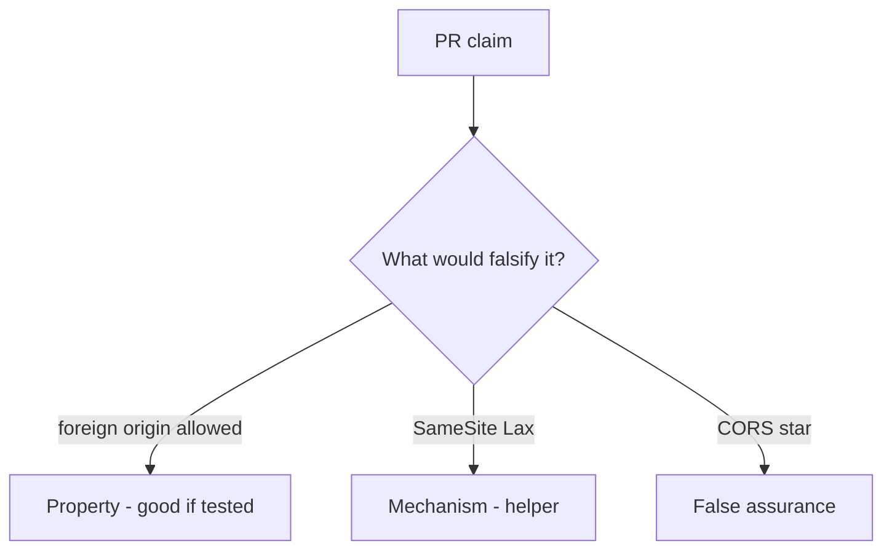

# 6.3-LO-08 — Review cookie-only share POST as a PR, not a SameSite ticket

**Kind:** code-review
**Loop step:** Review
**Standards:** OWASP ASVS 5.0.0 (final) `v5.0.0-3.5.1`.

## Review the fixture as if it were SecureCollab share

Review `labs/6.3/6.3-lab/vulnerable/` as a SecureCollab PR. Intended findings live only in `content/assessment/keys/6.3.md` — not here.

## Mental model: Cookie auth + no Origin check

Start with this seeded smell: **Cookie auth + no Origin check**. Label it property, mechanism, or false assurance before you accept the PR.

Seeded smells (label them yourself; do not open the keys file):

- Cookie auth + no Origin check
- GET `/share?to=`
- CORS `*` with credentials
- Token in a cookie not bound to the session

Also reject: live third-party CSRF, keys in lessons.

## Misconceptions

- SameSite is CSRF done
- JSON APIs cannot CSRF
- CORS is CSRF defense

## Practice

Write three review notes. Tie at least one to `test_foreign_origin_post_is_denied`.

## Transfer

Clinic PR that “set SameSite=Lax” without an origin×token test is incomplete.
